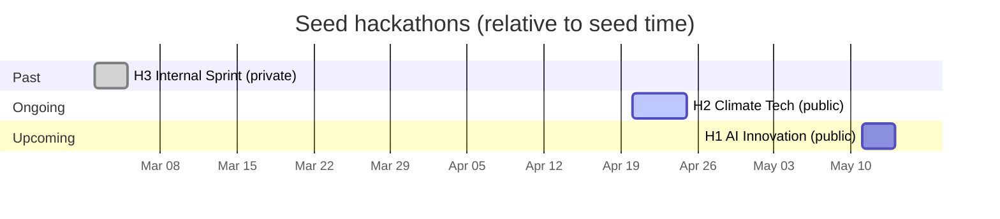

# Seed Data

`just db::seed` populates the database with a fixture designed to exercise the
UI across past / ongoing / upcoming hackathons, public and private visibility,
approved and proposed projects, draft and final submissions, and a waitlisted
participant. All timestamps are relative to `time.Now()` at seed time, so
re-seeding keeps the ongoing hackathon ongoing. Each hackathon also gets the
capabilities its phase calls for — see [Capabilities](#capabilities).

Running again when the sentinel hackathon (`AI Innovation Challenge 2026`)
already exists is a no-op.

## Users

Seeded via Keycloak IDs that match the dev realm. The admin's Keycloak ID comes
from config; the other three are hardcoded constants in [main.go](main.go).

| Username         | Display name      | Role across the seed                           |
| ---------------- | ----------------- | ---------------------------------------------- |
| `hackagon-admin` | Hackagon Admin    | Creator of H2 and H3; team member in all three |
| `alice`          | Alice Wonderland  | Creator of H1; participant in H2 and H3        |
| `bob`            | Bob Henderson     | Participant in H1 and H2; member of Team Gamma |
| `charles`        | Charles Whitfield | Waitlisted for H1; does not appear elsewhere   |

## Hackathons at a glance

| #   | Name                         | Visibility | Timing   | Span (days from seed)  | Creator        | Teams | Submissions         |
| --- | ---------------------------- | ---------- | -------- | ---------------------- | -------------- | ----- | ------------------- |
| H1  | AI Innovation Challenge 2026 | public     | upcoming | `+19` to `+21`         | alice          | 2     | Alpha: draft, final |
| H2  | Climate Tech Hackathon 2026  | public     | ongoing  | `-2` to `+2`           | hackagon-admin | 1     | Gamma: final        |
| H3  | Internal Product Sprint      | private    | past     | `-1mo-20` to `-1mo-18` | hackagon-admin | 1     | Delta: draft, final |

## Timeline

Illustrative dates below assume a seed run on **2026-04-22**. Actual dates slide
with when you run `just db::seed`.

Phase-level timing is listed in each hackathon's section below.

## Capabilities

Each hackathon gets a `HackathonState` row plus the casbin policy rows that go
with it, so capability-gated mutations actually work in seeded data. Both writes
are needed: the boolean on the row is what the UI reads, but the enforcer only
ever reads the casbin policy — see `seedCapabilities` in [main.go](main.go).

|                     | H1 upcoming | H2 ongoing | H3 past |
| ------------------- | ----------- | ---------- | ------- |
| Register            | ✅          | —          | —       |
| Propose projects    | ✅          | ✅         | —       |
| Team preferences    | ✅          | ✅         | —       |
| Project submissions | ✅          | ✅         | —       |
| Vote                | —           | —          | —       |
| View results        | —           | —          | ✅      |

Chosen to match each hackathon's phase: H1 is taking sign-ups and proposals, H2
is running, H3 is over. Registration is off for H2 because it started two days
ago — **H1 is where joining is testable**. Voting is off everywhere, since there
are no `Vote` tables yet.

**Preferences: test in H1 or H2.** H2 is the clearest case — `hackagon-admin`
owns it, `alice` and `bob` are both confirmed members.

One deliberate divergence from the API: `SetCapabilities` grants team
preferences to `Member` only, and the casbin model has no role inheritance, so a
hackathon **owner** cannot express a preference on a project they would like to
work on. The seed grants the owner row too, so the fixture shows the intended
behaviour. Tracked in
`mydocs/docs/backend-tickets/project-preferences-capability.md`; the row is one
line in `seedCapabilities` if you would rather mirror the handler exactly.

## Phases

Every phase carries **capability tags** and every hackathon but H1 has a
**current phase**. Both are set by `seedPhases` / `seedCapabilities` in
[main.go](main.go).

The two are unrelated to the table above, and that is the point:

- **`Phase.capabilities` is descriptive.** It says when something is _meant_ to
  happen. Nothing reads it to gate anything — `db/schema/phase.go` says so
  outright.
- **`HackathonState` is what actually gates.** The table above is the real one.
- **`current_phase_id` is display-only.** `SetCurrentPhase` moves a pointer; it
  touches neither the booleans nor casbin.

So a phase tagged `vote` inside a hackathon whose `voting_enabled` is false is a
correct fixture, not a contradiction — H1's Judging phase is exactly that.

| Hackathon | Phase    | Tags                               | Current |
| --------- | -------- | ---------------------------------- | ------- |
| H1        | Ideation | propose projects, team preferences | —       |
| H1        | Hacking  | project submissions                | —       |
| H1        | Judging  | vote, view results                 | —       |
| H2        | Ideation | propose projects, team preferences | —       |
| H2        | Hacking  | project submissions                | ✅      |
| H2        | Judging  | vote, view results                 | —       |
| H3        | Ideation | propose projects, team preferences | —       |
| H3        | Building | project submissions                | —       |
| H3        | Demo     | vote, view results                 | ✅      |

Three states worth having, one per hackathon:

- **H1 has no current phase** — the doors have not opened, so it is not "in" any
  phase. Exercises an empty `current_phase_id`.
- **H2's current phase is Hacking**, which is also the phase today falls inside,
  so the declared phase and a date-derived one agree.
- **H3's current phase is Demo**, and every one of its phases is in the past —
  so a date-derived reading calls them all completed while the declared phase
  still names one. This is the fixture that shows the two are different
  mechanisms.

`register` is tagged on no phase: none of the nine is a sign-up window, so
tagging one would misdescribe the fixture.

## User involvement

| User           | H1 AI Innovation                             | H2 Climate Tech                   | H3 Internal Sprint                |
| -------------- | -------------------------------------------- | --------------------------------- | --------------------------------- |
| hackagon-admin | member of Team Alpha                         | **creator**; member of Team Gamma | **creator**; member of Team Delta |
| alice          | **creator**; member of Team Alpha, Team Beta | participant                       | member of Team Delta              |
| bob            | participant                                  | member of Team Gamma              | —                                 |
| charles        | _waitlisted_                                 | —                                 | —                                 |

## H1 — AI Innovation Challenge 2026

Phases:

- Ideation — day `+19`, 09:00–18:00
- Hacking — day `+20`, 09:00–21:00
- Judging — day `+21`, 10:00–16:00

No current phase — the hackathon has not started.

Tracks: **Machine Learning**, **Natural Language Processing**, **Computer
Vision**

| Track | Project                      | Status   | Proposed by                      |
| ----- | ---------------------------- | -------- | -------------------------------- |
| ML    | AutoML Pipeline Builder      | approved | alice                            |
| ML    | Federated Learning Framework | proposed | bob                              |
| NLP   | Multilingual Chatbot         | approved | alice                            |
| NLP   | Document Summarizer          | proposed | bob                              |
| CV    | Real-time Object Detection   | approved | bob (modified by hackagon-admin) |

| Team       | Project                 | Members               | Submissions                                                  |
| ---------- | ----------------------- | --------------------- | ------------------------------------------------------------ |
| Team Alpha | AutoML Pipeline Builder | alice, hackagon-admin | v1 draft; v2 final → `github.com/team-alpha/automl-pipeline` |
| Team Beta  | Multilingual Chatbot    | alice                 | —                                                            |

Pages: `Welcome`, `Schedule` (visible); `Rules & Guidelines` (hidden).

## H2 — Climate Tech Hackathon 2026

Phases:

- Ideation — days `-2` to `-1` (all-day)
- Hacking — days `0` to `+1` (all-day) — **current phase**
- Judging — day `+2`, 09:00–17:00

Tracks: **Energy**, **Agriculture & Food**

| Track     | Project               | Status   | Proposed by |
| --------- | --------------------- | -------- | ----------- |
| Energy    | Solar Panel Optimizer | approved | bob         |
| Energy    | Smart Grid Monitor    | proposed | alice       |
| Agri-Food | Crop Disease Detector | approved | alice       |

| Team       | Project               | Members             | Submissions                                        |
| ---------- | --------------------- | ------------------- | -------------------------------------------------- |
| Team Gamma | Solar Panel Optimizer | bob, hackagon-admin | v1 final → `github.com/team-gamma/solar-optimizer` |

Pages: `About`, `Judging Criteria`, `Resources` (all visible).

## H3 — Internal Product Sprint

Phases (dates are 1 month + ~20 days before seed time):

- Ideation — day `-1mo-20`, 09:00–18:00
- Building — day `-1mo-19`, 09:00–21:00
- Demo — day `-1mo-18`, 10:00–16:00 — **current phase** (all phases are past)

Tracks: **Developer Tools**, **Data Platform**

| Track    | Project                  | Status   | Proposed by |
| -------- | ------------------------ | -------- | ----------- |
| DevTools | CLI Code Generator       | approved | admin       |
| DevTools | Test Coverage Dashboard  | proposed | alice       |
| Data     | Data Pipeline Visualizer | approved | alice       |

| Team       | Project            | Members               | Submissions                                             |
| ---------- | ------------------ | --------------------- | ------------------------------------------------------- |
| Team Delta | CLI Code Generator | hackagon-admin, alice | v1 draft; v2 final → `github.com/internal/cli-code-gen` |

Pages: `Overview`, `Technical Specs`, `Timeline` (all visible).
