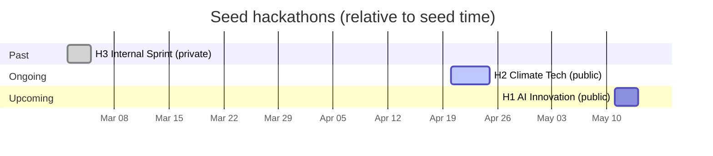

# Seed Data

`just seed` populates the database with a fixture designed to exercise the UI
across past / ongoing / upcoming hackathons, public and private visibility,
approved and proposed projects, draft and final submissions, and a waitlisted
participant. All timestamps are relative to `time.Now()` at seed time, so
re-seeding keeps the ongoing hackathon ongoing.

Running again when the sentinel hackathon (`AI Innovation Challenge 2026`)
already exists is a no-op.

## Users

Seeded via Keycloak IDs that match the dev realm. The admin's Keycloak ID comes
from config; the other three are hardcoded constants in [main.go](main.go).

| Username         | Display name      | Role across the seed                           |
| ---------------- | ----------------- | ---------------------------------------------- |
| `hackagon-admin` | Hackagon Admin    | Creator of H2 and H3; team member in all three |
| `alice`          | Alice Wonderland  | Creator of H1; participant in H2 and H3        |
| `bob`            | Bob Henderson     | Participant in H1 and H2; member of Team Gamma |
| `charles`        | Charles Whitfield | Waitlisted for H1; does not appear elsewhere   |

## Hackathons at a glance

| #   | Name                         | Visibility | Timing   | Span (days from seed)  | Creator        | Teams | Submissions         |
| --- | ---------------------------- | ---------- | -------- | ---------------------- | -------------- | ----- | ------------------- |
| H1  | AI Innovation Challenge 2026 | public     | upcoming | `+19` to `+21`         | alice          | 2     | Alpha: draft, final |
| H2  | Climate Tech Hackathon 2026  | public     | ongoing  | `-2` to `+2`           | hackagon-admin | 1     | Gamma: final        |
| H3  | Internal Product Sprint      | private    | past     | `-1mo-20` to `-1mo-18` | hackagon-admin | 1     | Delta: draft, final |

## Timeline

Illustrative dates below assume a seed run on **2026-04-22**. Actual dates slide
with when you run `just seed`.

Phase-level timing is listed in each hackathon's section below.

## User involvement

| User           | H1 AI Innovation                             | H2 Climate Tech                   | H3 Internal Sprint                |
| -------------- | -------------------------------------------- | --------------------------------- | --------------------------------- |
| hackagon-admin | member of Team Alpha                         | **creator**; member of Team Gamma | **creator**; member of Team Delta |
| alice          | **creator**; member of Team Alpha, Team Beta | participant                       | member of Team Delta              |
| bob            | participant                                  | member of Team Gamma              | —                                 |
| charles        | _waitlisted_                                 | —                                 | —                                 |

## H1 — AI Innovation Challenge 2026

Phases:

- Ideation — day `+19`, 09:00–18:00
- Hacking — day `+20`, 09:00–21:00
- Judging — day `+21`, 10:00–16:00

Tracks: **Machine Learning**, **Natural Language Processing**, **Computer
Vision**

| Track | Project                      | Status   | Proposed by                      |
| ----- | ---------------------------- | -------- | -------------------------------- |
| ML    | AutoML Pipeline Builder      | approved | alice                            |
| ML    | Federated Learning Framework | proposed | bob                              |
| NLP   | Multilingual Chatbot         | approved | alice                            |
| NLP   | Document Summarizer          | proposed | bob                              |
| CV    | Real-time Object Detection   | approved | bob (modified by hackagon-admin) |

| Team       | Project                 | Members               | Submissions                                                  |
| ---------- | ----------------------- | --------------------- | ------------------------------------------------------------ |
| Team Alpha | AutoML Pipeline Builder | alice, hackagon-admin | v1 draft; v2 final → `github.com/team-alpha/automl-pipeline` |
| Team Beta  | Multilingual Chatbot    | alice                 | —                                                            |

Pages: `Welcome`, `Schedule` (visible); `Rules & Guidelines` (hidden).

## H2 — Climate Tech Hackathon 2026

Phases:

- Ideation — days `-2` to `-1` (all-day)
- Hacking — days `0` to `+1` (all-day)
- Judging — day `+2`, 09:00–17:00

Tracks: **Energy**, **Agriculture & Food**

| Track     | Project               | Status   | Proposed by |
| --------- | --------------------- | -------- | ----------- |
| Energy    | Solar Panel Optimizer | approved | bob         |
| Energy    | Smart Grid Monitor    | proposed | alice       |
| Agri-Food | Crop Disease Detector | approved | alice       |

| Team       | Project               | Members             | Submissions                                        |
| ---------- | --------------------- | ------------------- | -------------------------------------------------- |
| Team Gamma | Solar Panel Optimizer | bob, hackagon-admin | v1 final → `github.com/team-gamma/solar-optimizer` |

Pages: `About`, `Judging Criteria`, `Resources` (all visible).

## H3 — Internal Product Sprint

Phases (dates are 1 month + ~20 days before seed time):

- Ideation — day `-1mo-20`, 09:00–18:00
- Building — day `-1mo-19`, 09:00–21:00
- Demo — day `-1mo-18`, 10:00–16:00

Tracks: **Developer Tools**, **Data Platform**

| Track    | Project                  | Status   | Proposed by |
| -------- | ------------------------ | -------- | ----------- |
| DevTools | CLI Code Generator       | approved | admin       |
| DevTools | Test Coverage Dashboard  | proposed | alice       |
| Data     | Data Pipeline Visualizer | approved | alice       |

| Team       | Project            | Members               | Submissions                                             |
| ---------- | ------------------ | --------------------- | ------------------------------------------------------- |
| Team Delta | CLI Code Generator | hackagon-admin, alice | v1 draft; v2 final → `github.com/internal/cli-code-gen` |

Pages: `Overview`, `Technical Specs`, `Timeline` (all visible).
