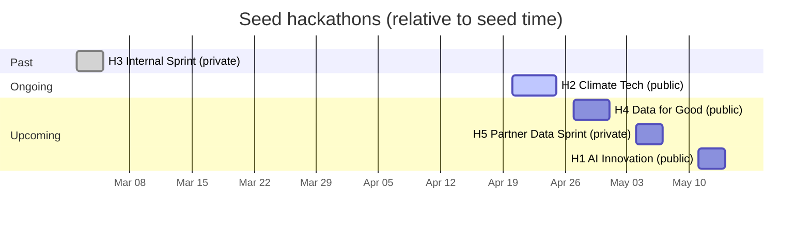

# Seed Data

`just db::seed` populates the database with a fixture designed to exercise the
UI across past / ongoing / upcoming hackathons, public and private visibility,
approved and proposed projects, draft and final submissions, a waitlisted
participant, invitation links in all three of their states, and — in H4 — a
hundred-person hackathon waiting for its teams to be formed. All timestamps are
relative to `time.Now()` at seed time, so re-seeding keeps the ongoing hackathon
ongoing. Each hackathon also gets the capabilities its phase calls for — see
[Capabilities](#capabilities).

Running again when all five hackathons already exist is a no-op. Finding _some_
of them is an error rather than either a skip or a re-seed: it means a previous
run died partway, and the fix is `just clean::state`. The seed is not atomic —
it drives the API, and several handlers open a transaction of their own, which
rules out wrapping the run in one.

## How the fixture is built

The seed calls the backend rather than writing rows. It stands the gRPC server
up in-process on an in-memory pipe — protovalidate and the auth interceptor
included — and drives it with tokens it signs itself, so it can act as any of
the fixture's identities without Keycloak. [harness.go](harness.go) says why
that is the only way to act as the hundred who have no Keycloak account, and
[steps.go](steps.go) holds the moves a hackathon is built out of.

Two consequences worth knowing:

- **A capability has to be on at the moment it is used.** Nothing a participant
  does can be seeded unless the capability behind it was enabled first, so each
  hackathon switches its capabilities on as its history needs them and ends with
  a call declaring the set it should be left in. That is what an organizer does
  over a hackathon's life, and it is now what the seed does too.
- **The rows are whatever the handlers write.** Where a handler leaves a field
  unset — `Team.Create` and `CreateSubmission` write no modifier, `Approve` does
  not update one — the seeded row has it unset too, and the fixture no longer
  quietly improves on the API. Page order starts at 0 for the same reason, and a
  single-choice vote stores `0` rather than nothing.
- **A team is created by an organizer or not at all.** `team:create` and
  `team:write` are granted to `owner` and nothing widens them, so Team Gamma —
  which this fixture used to record as bob's — is now the admin's. A
  participant-assembled team is not a state the API can produce.

The one thing the seed still writes directly is a registration answer, because
[no answer can be stored through the API at all](#the-answers-exception).

## Restart the backend after seeding

The seed writes casbin rows straight into the policy table, but the running
server loaded its policy at startup and does not reload. So immediately after
`just db::seed` every per-hackathon role the seed just granted is invisible to
the server, and the symptom is confusing: **the hackathon's owner is refused her
own hackathon.** `alice` gets `PermissionDenied` on `CreateQuestion` in H1, and
`ListParticipantAnswers` quietly returns only her own answers instead of the
cohort's, because the handler falls back to the no-write path.

A global admin is unaffected — `hackagon-admin` passes through the
`g2(r.sub, "admin")` escape hatch, whose grant comes from config at startup
rather than from a seeded row — which makes it look even more like a permission
bug in the handler.

```bash
just deploy::down && just deploy::up   # keeps the data, reloads the policy
```

This applies to the documented order too
(`just clean::state && just start && just db::seed`), since the backend is up
before the seed runs.

## Users

Seeded via Keycloak IDs that match the dev realm. The admin's Keycloak ID comes
from config; the others are hardcoded constants in [main.go](main.go).

`bob` and `charles` take part in H4, so signing in as either lands you inside
the large fixture; `alice` lands there as its organizer.

| Username         | Display name      | Role across the seed                                | Can log in |
| ---------------- | ----------------- | --------------------------------------------------- | ---------- |
| `hackagon-admin` | Hackagon Admin    | Global admin; creator and owner of H2 and H3        | yes        |
| `alice`          | Alice Wonderland  | Creator of H1, H4 and H5; participant in H1, H2, H3 | yes        |
| `bob`            | Bob Henderson     | Participant in H1, H2, H4; Teams Beta, Gamma        | yes        |
| `charles`        | Charles Whitfield | Waitlisted for H1; confirmed participant in H4      | yes        |
| `dana`           | Dana Okonkwo      | Participant in H1 and H3; waitlisted in H5          | **no**     |
| `yuki`           | Yuki Tanaka       | Participant in H2; Team Gamma                       | **no**     |

**`hackagon-admin` is a participant in nothing.** He is the platform operator —
global admin, and owner of the two hackathons he created — which is a job rather
than a seat. Keeping him out means the global-admin escape hatch is exercised
from genuinely outside a hackathon, not by a member who also happens to be an
admin. The same rule covers `alice` in H4: no owner takes part in the hackathon
they run.

**`dana` and `yuki` exist in Postgres only.** They have no Keycloak account, so
nobody can sign in as them — same as [the hundred in H4](#the-hundred-in-h4).
They hold the team seats `hackagon-admin` used to, so every team keeps its size
and H3 keeps two voters. Drive the app as `alice`, `bob` or `charles`.

### The hundred in H4

H4 adds **100 synthetic participants** on top of `bob` and `charles` — Keycloak
IDs `seed-dfg-001` … `seed-dfg-100`, names built from two 20-entry lists in
[main.go](main.go) (`amara.abela`, `bruno.abela`, …).

**They exist in Postgres only.** There is no Keycloak account behind any of
them, so none can log in, and that is deliberate: they are bulk, not actors. To
look at what they produced, sign in as `bob` or `charles`, who are in H4 with
them, or as `alice`, who runs it.

They hold the casbin `Member` role in H4 and nothing else. No hackathon `Owner`,
no project-scoped `Owner`.

## Hackathons at a glance

| #   | Name                         | Visibility | Timing   | Span (days from seed)  | Creator        | Teams | Submissions                         |
| --- | ---------------------------- | ---------- | -------- | ---------------------- | -------------- | ----- | ----------------------------------- |
| H1  | AI Innovation Challenge 2026 | public     | upcoming | `+19` to `+21`         | alice          | 2     | Alpha: draft, final                 |
| H2  | Climate Tech Hackathon 2026  | public     | ongoing  | `-2` to `+2`           | hackagon-admin | 1     | Gamma: final                        |
| H3  | Internal Product Sprint      | private    | past     | `-1mo-20` to `-1mo-18` | hackagon-admin | 2     | Delta: draft, final; Epsilon: final |
| H4  | Data for Good Hackathon 2026 | public     | upcoming | `+5` to `+8`           | alice          | **0** | —                                   |
| H5  | Partner Data Sprint 2026     | private    | upcoming | `+12` to `+14`         | alice          | **0** | —                                   |

## Timeline

Illustrative dates below assume a seed run on **2026-04-22**. Actual dates slide
with when you run `just db::seed`.



H4's registration window (`-21` to `-3`) and team-formation phase (`-3` to `+4`)
run **before** the event itself, which is why it is upcoming and yet already has
a hundred confirmed participants and their preferences on file.

Phase-level timing is listed in each hackathon's section below.

## Capabilities

Each hackathon's capabilities are declared with `SetCapabilities`, which is the
only call that writes both halves: the boolean on the state row, which the UI
reads, and the casbin policy, which is the only thing the enforcer reads. The
seed states all six on every call, so the set below is a declaration rather than
a patch on whatever was there before.

|                     | H1 upcoming | H2 ongoing | H3 past | H4 forming teams | H5 invite-only |
| ------------------- | ----------- | ---------- | ------- | ---------------- | -------------- |
| Register            | ✅          | —          | —       | —                | ✅             |
| Propose projects    | ✅          | ✅         | —       | ✅               | —              |
| Team preferences    | ✅          | ✅         | —       | ✅               | —              |
| Project submissions | ✅          | ✅         | —       | —                | —              |
| Vote                | —           | —          | ✅      | —                | —              |
| View results        | —           | —          | ✅      | —                | —              |

Chosen to match each hackathon's phase: H1 is taking sign-ups and proposals, H2
is running, H3 is over, H4 has closed its doors and is sorting people into
teams. Registration is off for H2 because it started two days ago, and off for
H4 because sign-up closed three days ago — **H1 is where joining a public
hackathon is testable**, **H5 is where joining a private one is** (the only
private hackathon with `register` on), and **H4 is where a refused `Join` is the
correct answer** rather than a misconfiguration. H5 carries `register` and
nothing else because it is the fixture for the door rather than the room: the
sprint has not started, so there is nothing inside for a confirmed member to do
yet. Voting is on in H3 only, which is where it belongs — you vote once the
building has stopped. **H3 is therefore the only place voting is testable.**

`vote` writes **three** casbin rows, not one: `Vote:Create`, `VoteCategory:Read`
and `Submission:Read`. The second is the one that looks redundant and is not —
`ListVoteCategories`, `GetVoteCategory` and `SubmitVote` all check
`VoteCategory:Read` before anything else, so a member without it cannot see what
there is to vote on and `SubmitVote` refuses before `Vote:Create` is ever
consulted. The third lets a voter read the submissions they are voting on; the
seed used to hand-write the first two and miss it, which is the kind of drift
going through the handler removes.

**Preferences: test in H1, H2 or H4.** H2 is the clearest small case —
`hackagon-admin` owns it, `alice` and `bob` are both confirmed members. **H4 is
the one with volume**: 15 projects, 102 participants and ~260 preference rows
already on file, which is what you want if you are looking at a preference
export, a popularity ranking, or a team-assignment algorithm.

`SetCapabilities` grants team preferences to `Member` only, and the casbin model
has no role inheritance, so a hackathon **owner** cannot express a preference on
a project they would like to work on. The seed used to add the owner row by hand
so the fixture showed the intended behaviour; going through the handler means it
no longer does, and the seeded hackathons now behave exactly as the API does.
Tracked in `mydocs/docs/backend-tickets/project-preferences-capability.md`.

### The answers exception

`Join` and `SubmitAnswers` both build their upsert with no conflict target,
which Postgres rejects when it parses the statement, so **every** call carrying
an answer fails — see `mydocs/docs/backend-tickets/answer-upsert-sql.md`, which
names the three-line fix. The seed calls `SubmitAnswers` anyway, so the handler
still validates the answers, and falls back to writing the rows itself on
exactly that failure. Two consequences while the ticket is open:

- `just db::seed` logs one `upsert answer` ERROR per participant with answers.
  That is the handler's own log line, and the seed still succeeds.
- Signups happen **before** a hackathon's form is created, since `Join` would
  otherwise have to carry answers it cannot store. That ordering is also what
  leaves charles waitlisted in H1 with nothing on file.

## Registration questions

Organizer-defined questions answered at sign-up — read with `ListQuestions`,
answered through `Join` or later revised with `SubmitAnswers`. Four of the five
hackathons ask something; **H3 asks nothing**, which is the fixture for a
hackathon with no form at all.

| #   | Questions                                                                              | Mandatory              | Answered by                                  |
| --- | -------------------------------------------------------------------------------------- | ---------------------- | -------------------------------------------- |
| H1  | `affiliation` (text), `tshirt_size` (enum), `dietary` (text), `code_of_conduct` (bool) | all but `dietary`      | alice, bob, dana — **not** charles           |
| H2  | `affiliation` (text), `experience_level` (enum)                                        | both                   | alice, bob, yuki (everyone)                  |
| H3  | —                                                                                      | —                      | —                                            |
| H4  | `affiliation` (text), `tshirt_size` (enum), `remote` (bool)                            | all but `remote`       | roughly 6 in 7 of the hundred                |
| H5  | `affiliation` (text), `data_agreement` (bool), `access_needs` (text)                   | all but `access_needs` | nobody — dana joined before the form existed |

H1 is where the sign-up flow is exercised: it is the only hackathon with
`register` on, so a newcomer reads the questions before joining and sends the
answers along with `Join`. Its mandatory questions are what make `Join` refuse
an empty sign-up. H2's form is closed by contrast — `register` is off and
everyone has already answered.

**Only people who answered have rows at all.** `charles` in H1 is waitlisted and
has answered nothing, and about one in seven of H4's hundred never answered
either. The gap is deliberate: "has not filled it in" and "filled it in and left
the optional parts blank" are different facts to an organizer chasing people,
and `bob` in H1 is the second case — he skips `dietary`. Of the H4 participants
who did answer, about two thirds also answered the optional `remote`, and a
`false` there is an answer rather than an absence.

Answers are stored as strings whatever the question's type — `"true"`/`"false"`
for a bool, the option text for an enum — because that is what `SubmitAnswers`
writes. The fixture has to agree with the handler here, or a seeded answer reads
back as something the API could never have produced.

The H4 answers are drawn from `dataForGoodAnswerSeed`, a random stream of its
own, so adding or changing them cannot shift the preference draw that follows.

## Phases

Every phase carries **capability tags** and every hackathon but H1 has a
**current phase**. Both are set by `seedPhases` / `seedCapabilities` in
[main.go](main.go).

The two are unrelated to the table above, and that is the point:

- **`Phase.capabilities` is descriptive.** It says when something is _meant_ to
  happen. Nothing reads it to gate anything — `db/schema/phase.go` says so
  outright.
- **`HackathonState` is what actually gates.** The table above is the real one.
- **`current_phase_id` is display-only.** `SetCurrentPhase` moves a pointer; it
  touches neither the booleans nor casbin.

So a phase tagged `vote` inside a hackathon whose `voting_enabled` is false is a
correct fixture, not a contradiction — H1's Judging phase is exactly that.

| Hackathon | Phase          | Tags                               | Current |
| --------- | -------------- | ---------------------------------- | ------- |
| H1        | Ideation       | propose projects, team preferences | —       |
| H1        | Hacking        | project submissions                | —       |
| H1        | Judging        | vote, view results                 | —       |
| H2        | Ideation       | propose projects, team preferences | —       |
| H2        | Hacking        | project submissions                | ✅      |
| H2        | Judging        | vote, view results                 | —       |
| H3        | Ideation       | propose projects, team preferences | —       |
| H3        | Building       | project submissions                | —       |
| H3        | Demo           | vote, view results                 | ✅      |
| H4        | Registration   | register                           | —       |
| H4        | Team Formation | propose projects, team preferences | ✅      |
| H4        | Hacking        | project submissions                | —       |
| H4        | Demo           | vote, view results                 | —       |

Four states worth having, one per hackathon:

- **H1 has no current phase** — the doors have not opened, so it is not "in" any
  phase. Exercises an empty `current_phase_id`.
- **H2's current phase is Hacking**, which is also the phase today falls inside,
  so the declared phase and a date-derived one agree.
- **H3's current phase is Demo**, and every one of its phases is in the past —
  so a date-derived reading calls them all completed while the declared phase
  still names one. This is the fixture that shows the two are different
  mechanisms.
- **H4's current phase is Team Formation**, which runs _before_ the hackathon's
  own start date. The declared phase and the dates agree, while the hackathon
  itself is still upcoming — the case where "which phase are we in" and "has it
  started" have different answers.

`register` is tagged on exactly one phase, H4's `Registration`. None of H1–H3's
nine phases is a sign-up window, so tagging one of those would misdescribe the
fixture.

## User involvement

| User           | H1 AI Innovation                  | H2 Climate Tech                            | H3 Internal Sprint                         | H4 Data for Good                           | H5 Partner Sprint                          |
| -------------- | --------------------------------- | ------------------------------------------ | ------------------------------------------ | ------------------------------------------ | ------------------------------------------ |
| hackagon-admin | _not a participant_               | **creator** and owner; _not_ a participant | **creator** and owner; _not_ a participant | _not a participant_                        | _not a participant_                        |
| alice          | **creator**; member of Team Alpha | participant                                | member of Team Delta                       | **creator** and owner; _not_ a participant | **creator** and owner; _not_ a participant |
| bob            | participant; member of Team Beta  | member of Team Gamma                       | —                                          | participant; proposed 5 of the 15 projects | — left free to redeem a link by hand       |
| charles        | _waitlisted_                      | —                                          | —                                          | participant (confirmed)                    | — left free to redeem a link by hand       |
| dana           | member of Team Alpha              | —                                          | member of Team Epsilon                     | —                                          | _waitlisted_, via the live invitation      |
| yuki           | —                                 | member of Team Gamma                       | —                                          | —                                          | —                                          |

**Nobody belongs to two teams in the same hackathon.** A person works on one
project, so `alice` holds Team Alpha and `bob` holds Team Beta rather than alice
holding both. Across hackathons is another matter — `alice` is on Team Alpha in
H1 and Team Delta in H3, and `dana` on Alpha and Epsilon. That also sharpens the
cross-team read case: bob is a plain `Member` of Team Beta with no policy row
matching Team Alpha's domain, where alice's hackathon-wide `Owner` made every
such read succeed for the wrong reason
(`mydocs/docs/backend-tickets/submission-cross-team-read.md`).

### Ownership is stored twice

Every hackathon writes its creator into **both** stores, exactly as
`HackathonService.Create` does:

| Store                    | Written by         | Read by                                                  |
| ------------------------ | ------------------ | -------------------------------------------------------- |
| casbin `owner` role      | `enf.AddRole`      | the enforcer; the `Owner` badge in the participants list |
| `owners` edge on the row | `.AddOwners(user)` | `RemoveOwner`, to refuse removing the **last** owner     |

Write only the casbin half and the two disagree in a way that is annoying to
debug: the UI labels the person `Owner`, but `RemoveOwner` counts the edge,
finds nobody there, and refuses to remove anyone else with
`cannot remove the last owner of a hackathon`. Add an owner through the UI and
only _they_ land in the edge — so the newest owner is the one the backend treats
as the last.

**Alice holds two casbin roles in H1, `Owner` and `Member`, and needs both.**
The model has no role inheritance, so `Owner` does not imply `Member`, while
every capability `seedCapabilities` grants is granted to `Member`. With `Owner`
alone she can administer H1 but cannot vote, propose or set a preference in it —
an assignment that looks half-finished rather than deliberate. The same applies
to her in H4. Creators of H2 and H3 are owners only, which is the contrasting
case worth keeping.

## H1 — AI Innovation Challenge 2026

Phases:

- Ideation — day `+19`, 09:00–18:00
- Hacking — day `+20`, 09:00–21:00
- Judging — day `+21`, 10:00–16:00

No current phase — the hackathon has not started.

Tracks: **Machine Learning**, **Natural Language Processing**, **Computer
Vision**

| Track | Project                      | Status   | Proposed by                      |
| ----- | ---------------------------- | -------- | -------------------------------- |
| ML    | AutoML Pipeline Builder      | approved | alice                            |
| ML    | Federated Learning Framework | proposed | bob                              |
| NLP   | Multilingual Chatbot         | approved | alice                            |
| NLP   | Document Summarizer          | proposed | bob                              |
| CV    | Real-time Object Detection   | approved | bob (modified by hackagon-admin) |

| Team       | Project                 | Members     | Submissions                                                  |
| ---------- | ----------------------- | ----------- | ------------------------------------------------------------ |
| Team Alpha | AutoML Pipeline Builder | alice, dana | v1 draft; v2 final → `github.com/team-alpha/automl-pipeline` |
| Team Beta  | Multilingual Chatbot    | bob         | —                                                            |

Pages: `Welcome`, `Schedule` (visible); `Rules & Guidelines` (hidden).

## H2 — Climate Tech Hackathon 2026

Phases:

- Ideation — days `-2` to `-1` (all-day)
- Hacking — days `0` to `+1` (all-day) — **current phase**
- Judging — day `+2`, 09:00–17:00

Tracks: **Energy**, **Agriculture & Food**

| Track     | Project               | Status   | Proposed by |
| --------- | --------------------- | -------- | ----------- |
| Energy    | Solar Panel Optimizer | approved | bob         |
| Energy    | Smart Grid Monitor    | proposed | alice       |
| Agri-Food | Crop Disease Detector | approved | alice       |

| Team       | Project               | Members   | Submissions                                        |
| ---------- | --------------------- | --------- | -------------------------------------------------- |
| Team Gamma | Solar Panel Optimizer | bob, yuki | v1 final → `github.com/team-gamma/solar-optimizer` |

Pages: `About`, `Judging Criteria`, `Resources` (all visible).

## H3 — Internal Product Sprint

Phases (dates are 1 month + ~20 days before seed time):

- Ideation — day `-1mo-20`, 09:00–18:00
- Building — day `-1mo-19`, 09:00–21:00
- Demo — day `-1mo-18`, 10:00–16:00 — **current phase** (all phases are past)

Tracks: **Developer Tools**, **Data Platform**

| Track    | Project                  | Status   | Proposed by |
| -------- | ------------------------ | -------- | ----------- |
| DevTools | CLI Code Generator       | approved | admin       |
| DevTools | Test Coverage Dashboard  | proposed | alice       |
| Data     | Data Pipeline Visualizer | approved | alice       |

| Team         | Project                  | Members | Submissions                                             |
| ------------ | ------------------------ | ------- | ------------------------------------------------------- |
| Team Delta   | CLI Code Generator       | alice   | v1 draft; v2 final → `github.com/internal/cli-code-gen` |
| Team Epsilon | Data Pipeline Visualizer | dana    | v1 final → `github.com/internal/data-pipeline-viz`      |

Pages: `Overview`, `Technical Specs`, `Timeline` (all visible).

### Voting

H3 is the only hackathon with voting on, so it is the only place the voting UI
can be exercised. One category, `Best Project` — single choice, all participants
— with two votes already cast and a two-way tie for first place recorded as
results.

**The one-member-per-team split above is what makes voting work at all.**
`SubmitVote` refuses a vote on a submission by a team you belong to, so a
participant who is on every team cannot vote on anything. With alice on Delta
and dana on Epsilon, each can vote for the other, and the two seeded votes are
exactly that. It is also why H3 needed a second participant once
`hackagon-admin` stopped being one: with alice alone there is nobody left to
cast the other vote. Put both people back on both teams and H3 goes back to
having voting enabled and nothing votable in it.

Votes and results here are written straight through ent, not through
`SubmitVote`, so no handler validates them — the cross-team property has to be
kept true by hand if you add more.

---

## H4 — Data for Good Hackathon 2026

The large fixture, and the only one sitting in **team formation**: registration
has closed, 102 people are confirmed in, 15 projects are on the table, everybody
has said which ones they would like to work on — and **no team exists yet**.
That is the input a team-assignment algorithm takes, and none of H1–H3 provide
it: H1 and H2 have their teams pre-baked, H3 is over.

Phases:

- Registration — days `-21` to `-3` — tagged `register`
- Team Formation — days `-3` to `+4` — **current phase**
- Hacking — days `+5` to `+7`, 09:00–18:00
- Demo — day `+8`, 10:00–17:00

No tracks — see _Deliberately absent_ below.

### Projects and their pull

`weight` is how strongly a synthetic participant is drawn to a project, and the
spread is the whole point — an algorithm run against an even distribution is not
being exercised at all. Pick counts below are what the fixed PRNG seed
(`dataForGoodSeed`) actually produces, so they are stable across re-seeds.

| Project                   | Weight | Picks | Proposed by |
| ------------------------- | -----: | ----: | ----------- |
| Outbreak Early Warning    |     12 |    42 | bob         |
| Vaccine Desert Mapper     |      6 |    17 | alice       |
| Clinical Trial Matcher    |      4 |     9 | alice       |
| Air Quality & Asthma      |      3 |     9 | bob         |
| Ambulance Response Equity |      1 |     2 | alice       |
| Open Textbook Search      |     11 |    36 | alice       |
| Dropout Early Signal      |      7 |    15 | bob         |
| School Meal Coverage      |      5 |    16 | alice       |
| Sign Language Tutor       |      3 |    14 | alice       |
| Classroom Energy Audit    |      1 |     3 | bob         |
| Open Budget Explorer      |     10 |    26 | alice       |
| Bike Lane Gap Finder      |      8 |    30 | alice       |
| Rental Listing Watchdog   |      5 |    20 | bob         |
| Pothole Report Triage     |      2 |    12 | alice       |
| Council Minutes Search    |      1 |     7 | alice       |

All 15 are `approved`. Every proposer holds the project-scoped `Owner` role that
goes with having proposed one.

The two ends are the interesting ones: **Outbreak Early Warning has 42 people
wanting it** and will not fit in one team, while **Ambulance Response Equity has
2** and cannot reach quorum. Any assignment that only handles the middle will
show it here.

### Preferences

Each of the 102 participants named one to four projects — 12 named one, 40 named
two, 34 named three, 16 named four, for **258 preference rows** in total.
Preferences are an unranked M2M edge (`user.preferred_projects`); there is no
"first choice" in the schema, only a set.

The PRNG is seeded from a constant, never the clock, so re-seeding reproduces
the same fixture exactly. Change `dataForGoodSeed` if you want a different draw.

### Deliberately absent — do not "fix"

- **No teams and no submissions.** The state being modelled is the moment before
  teams exist. Submissions and voting are off for the same reason: there is
  nothing to submit yet.
- **alice owns this one without taking part in it.** She holds `Owner` and no
  participant row, so she is absent from the participant list, from the
  preference draw and from the pool the team formation page staffs teams from.
  No owner takes part in the hackathon they run, here or in H1-H3. Note that
  `register` being off (below) means she cannot change her mind through `Join`
  either.
- **`hackagon-admin` is not here either**, nor in any other hackathon. He is the
  platform operator, and a global admin who is also an ordinary participant
  tests the escape hatch against itself.
- **`register` is off.** Sign-up closed on day `-3`. This is the fixture where
  `Join` is refused because the window shut, not because something is
  misconfigured — contrast H1, where joining works.
- **The hundred hold `Member` and nothing else.** No hackathon or project
  `Owner`, and no Keycloak account, so none of them can log in.
- **No tracks.** Every project here carries none. This is the fixture for a
  hackathon that runs without them — the shape the first client needs — so the
  propose and edit forms drop their track picker, project rows carry no track,
  and the overview's track breakdown has nothing to group by. H1-H3 keep their
  tracks, so both shapes stay covered.

Pages: `About`, `How teams are formed`, `Code of Conduct` (all visible).

## H5 — Partner Data Sprint 2026

The invitation fixture, and **the only hackathon in which the invite flow can be
exercised at all**. H3 is private too, but it is over and its `register` is off,
so `Join` refuses before it ever looks at a token — which made every attempt to
test an invitation come back `PermissionDenied` for a reason that had nothing to
do with the invitation. H5 is private, upcoming and taking sign-ups, so a link
is the only way in and following one gets you somewhere.

No phases, no tracks, no projects, no pages. That is deliberate: this fixture is
the door, not the room. What it does have is a description written in markdown,
because the description is the whole of what an invitee sees before deciding —
`PreviewInvite` returns the shallow hackathon and nothing nested.

### The three invitations

| State       | Note on it                                  | `expires_at`                       |
| ----------- | ------------------------------------------- | ---------------------------------- |
| **live**    | `Partner mailing list — the live link.`     | day `+14`, the event's end         |
| **revoked** | `Forwarded outside the partners — revoked.` | day `+14`, but `revoked_at` is set |
| **expired** | `Last year's partner list — expired.`       | day `-1`                           |

The live one is the one dana used, and the one to test with. The other two exist
because neither can reasonably be made by hand: an organizer has no way to
backdate an expiry, and revoking is a one-way door — so without them the revoked
and expired refusals could only be seen once, by breaking the fixture.

`ListInvites` returns all three with no filter and no status field of its own,
so whatever renders them derives the state from the three timestamps.

### The links are printed

A token is unguessable by design, so the seed logs each one as a ready URL:

```
INFO H5 invitation link state=live    url=http://localhost:8081/invite/<token> note=...
INFO H5 invitation link state=revoked url=http://localhost:8081/invite/<token> note=...
INFO H5 invitation link state=expired url=http://localhost:8081/invite/<token> note=...
```

The origin is hardcoded because the frontend's dev port is not a variable
either: 8081 is fixed in `svelte.config.js`, held by `strictPort` in
`vite.config.ts`, and listed in the Keycloak realm's allowed redirects. The seed
talks to an in-process server and never sees an HTTP request, so it has no way
to learn a deployed origin.

To get them again without re-seeding, ask the API as the owner:

```bash
just rpc::as alice aliceandbob hackathon.HackathonService/ListInvites \
  '{"hackathonId": "<H5 id>"}'
```

### Why alice owns it

A global admin passes casbin's `g2(r.sub, "admin")` escape hatch, so testing the
organizer surfaces as `hackagon-admin` proves nothing about the
`hackathon:write` gate all four invite RPCs sit behind. alice holds `Owner` and
nothing else, which is the permission a real organizer has. She takes no part in
the sprint, same as in H4.

### Deliberately absent — do not "fix"

- **bob and charles are not in H5.** Both are left out so either can redeem a
  link by hand, which needs an account that can sign in to Keycloak. dana holds
  the seeded seat precisely because she cannot log in, so she can never be
  mistaken for the account you are meant to test as.
- **dana has answered nothing.** She joins on the live invitation _before_ the
  form is created, the same order H1 uses and for the same reason: `Join`
  refuses a sign-up leaving a mandatory question unanswered, and the seed's
  `joinWithInvite` sends no answers. So she is the fixture for somebody who got
  in before the form went up — waitlisted, with nothing on file to read.
- **dana is not approved.** Approval is a separate act, and somebody sitting in
  the queue is what gives the organizer's waitlist something to approve.
- **Something in the form is mandatory** (`affiliation` and `data_agreement`). A
  private hackathon that asked nothing could be joined by posting an empty form,
  and then an invitation page would only ever need a button. The mandatory
  questions are what make it have to carry the form.
