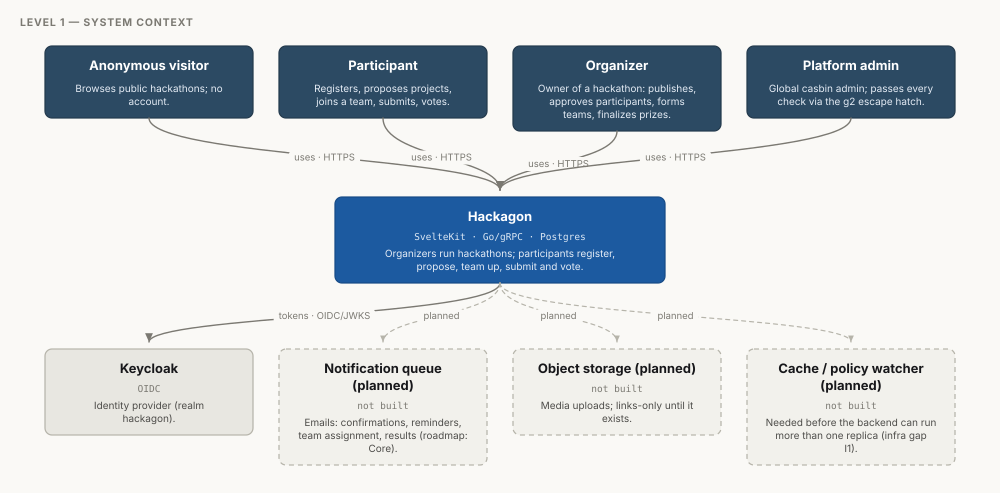
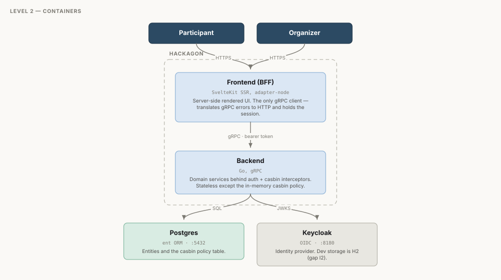
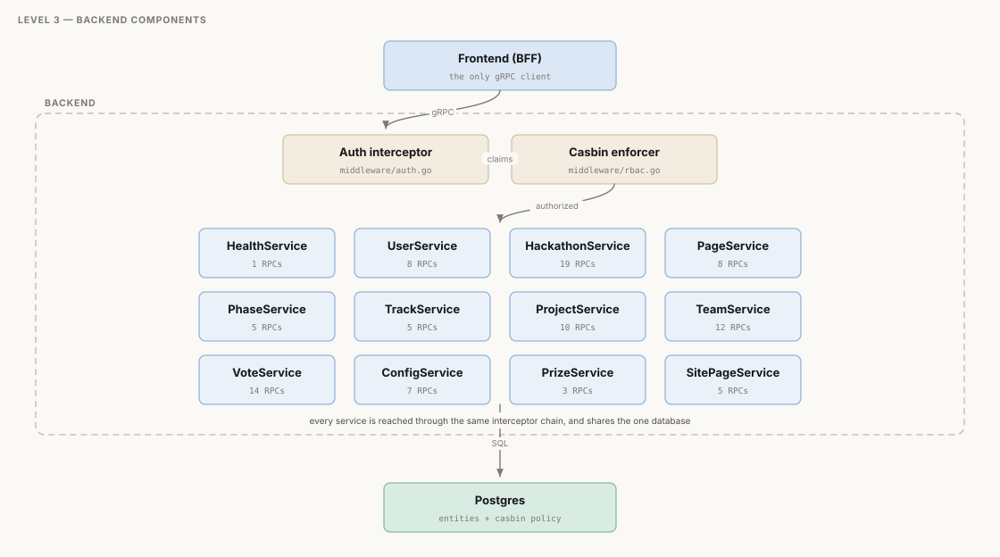

<!-- GENERATED by dev/scripts/render-docs.mjs — do not edit by hand.
     Sources: api/proto (contracts), the e2e capability probe (live status),
     recipe.jsonl (requirement coverage), dev/model/*.json (authored structure).
     Regenerate: node dev/scripts/build-model.mjs && node dev/scripts/build-flows.mjs && node dev/scripts/render-docs.mjs -->

# Architecture model (C4)

The architecture described in a standard way: the **C4 model** — context,
containers, components — plus the communication channels and the full
endpoint catalogue. This page is **generated** from one authored file
(`dev/model/structure.json`) joined with the protos, the live capability
probe and the executable spec, on the fully-qualified gRPC method name
(e.g. `hackathon.HackathonService/Join`).

> 13 services · 105 RPCs · 309 requirements ·
> 23 tables · generated from `sketch/06-08-26` @ `be4ccd22`.

## Level 1 — System context

Who uses Hackagon, and what it depends on. Dashed boxes are planned, not built.

## Level 2 — Containers

The four processes `just start` brings up. The frontend is the **only** gRPC
client — nothing in a browser talks to the backend directly.

## Level 3 — Backend components

All 12 gRPC services sit behind the same interceptor chain:
authentication resolves claims (or the anonymous subject), then casbin
authorizes against a path-shaped domain.

> ⚠ The casbin enforcer loads its policy **once at startup and never
> reloads** — see [infrastructure.md](infrastructure.md) gap I1. It is why the
> e2e suite restarts the backend after seeding, and why a second backend
> replica would diverge.

## Communication channels

| Channel | Protocol | Auth | Status |
| --- | --- | --- | --- |
| **Browser ↔ Frontend** <small>browser → frontend</small> | HTTPS <small>HTML over HTTP/1.1+2, SvelteKit SSR + form actions</small> | session cookie (Auth.js JWT strategy) | built |
| **Browser ↔ Keycloak** <small>browser → keycloak</small> | OIDC <small>authorization code flow, prompt=login</small> | user credentials | built |
| **Frontend ↔ Keycloak** <small>frontend → keycloak</small> | OIDC token endpoint <small>HTTPS POST</small> | client credentials + refresh token | built |
| **Frontend ↔ Backend** <small>frontend → backend</small> | gRPC <small>HTTP/2, protobuf; nice-grpc client, plaintext in dev</small> | Authorization: Bearer <access token>; anonymous allowed (subject 'anonymous') | built |
| **Backend ↔ Keycloak** <small>backend → keycloak</small> | JWKS <small>HTTPS GET, cached keys</small> | none (public keys) | built |
| **Backend ↔ Postgres** <small>backend → postgres</small> | SQL <small>pgx pool via ent</small> | connection credentials | built |
| **Backend ↔ casbin policy** <small>backend → postgres</small> | in-process <small>in-memory enforcer, loaded once at startup</small> | n/a | built |
| **Backend → Participants** <small>backend → participant</small> | SMTP / provider API <small>via a notification queue</small> | provider credentials | **planned** |
| **Frontend/Backend ↔ Object store** <small>backend → blob</small> | S3-compatible <small>presigned upload/download</small> | presigned URLs | **planned** |
| **Backend → SDSC leaderboard** <small>backend → leaderboard</small> | HTTPS API <small>outbound integration</small> | API token | **planned** |

Notes worth carrying: 3 channels are not built yet
(notifications, object storage, the external leaderboard), and the casbin policy
channel is in-process with the reload caveat above.

## Endpoint catalogue

Live status comes from the e2e capability probe; coverage counts how many
RPCs at least one requirement exercises.

| Service | RPCs | Probed live | With requirements |
| --- | ---: | ---: | ---: |
| `hackathon.ConfigService` | 9 | 7 | 7 |
| `hackathon.HackathonService` | 22 | 18 | 16 |
| `hackathon.PageService` | 8 | 2 | 2 |
| `hackathon.PhaseService` | 5 | 1 | 1 |
| `hackathon.PrizeService` | 4 | 3 | 3 |
| `hackathon.ProjectService` | 11 | 6 | 6 |
| `hackathon.TeamService` | 12 | 8 | 8 |
| `hackathon.TrackService` | 5 | 1 | 1 |
| `health.HealthService` | 1 | 0 | 0 |
| `site.SitePageService` | 5 | 5 | 3 |
| `storage.StorageService` | 2 | 2 | 1 |
| `user.UserService` | 8 | 5 | 5 |
| `vote.VoteService` | 15 | 6 | 6 |
| **total** | **107** | **64** | **59** |

### RPCs no requirement exercises (48)

Not necessarily untested — reads reached through a UI flow are exercised
without being named — but nothing *asserts* their behaviour.

| Service | RPCs |
| --- | --- |
| ConfigService | `GetEmailTemplates`, `GetWindows` |
| HackathonService | `AdvancePhase`, `CreateInvite`, `EditCapability`, `ListInvites`, `PreviewInvite`, `RevokeInvite` |
| HealthService | `Check` |
| PageService | `Edit`, `Get`, `List`, `MoveDown`, `MoveUp`, `SetOrder` |
| PhaseService | `Delete`, `Edit`, `Get`, `List` |
| PrizeService | `Get` |
| ProjectService | `Disapprove`, `Get`, `GetPreference`, `List`, `RemovePreference` |
| SitePageService | `Delete`, `List` |
| StorageService | `CreateDownloadUrl` |
| TeamService | `Get`, `GetSubmission`, `List`, `ListSubmissions` |
| TrackService | `Delete`, `Edit`, `Get`, `List` |
| UserService | `AddRole`, `Get`, `RemoveRole` |
| VoteService | `DeleteVoteCategory`, `DeleteVoteResult`, `EditVoteCategory`, `EditVoteResult`, `ExportResults`, `GetVote`, `GetVoteCategory`, `ListVoteCategories`, `ListVotes` |

Every method the requirements reference exists in the protos.

## How this page is produced

| Layer | Source | Authored? |
| --- | --- | --- |
| structure | `dev/model/structure.json` | **yes — the only hand-written file** |
| channels | `dev/model/channels.json` | **yes** |
| contracts | `api/proto/**` | generated |
| live status | e2e capability probe | generated |
| coverage | `recipe.jsonl` | generated |

The same model is also emitted as a **Structurizr DSL workspace**
(`dev/out/hackagon.dsl`) for standard C4 tooling, and as `dev/out/model.json`
for a custom visualizer. Those live in `dev/` and are not committed.

## See also

- [architecture.md](architecture.md) — the same system in prose, with the request flow.
- [backend/services.md](backend/services.md) — what each service and RPC does.
- [infrastructure.md](infrastructure.md) — what production would need (gaps I1–I4).
- [testing.md](testing.md) — the probe and recipe this page joins against.
