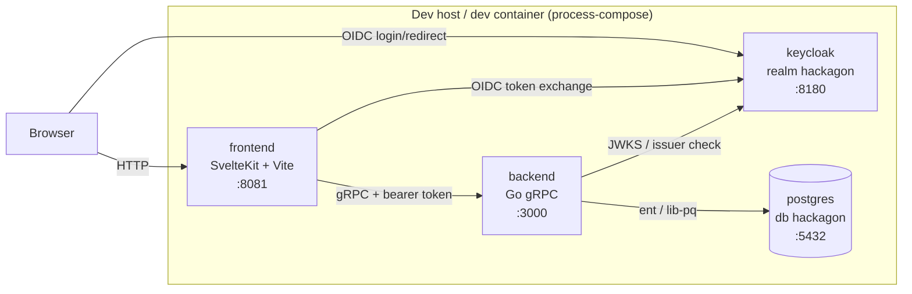
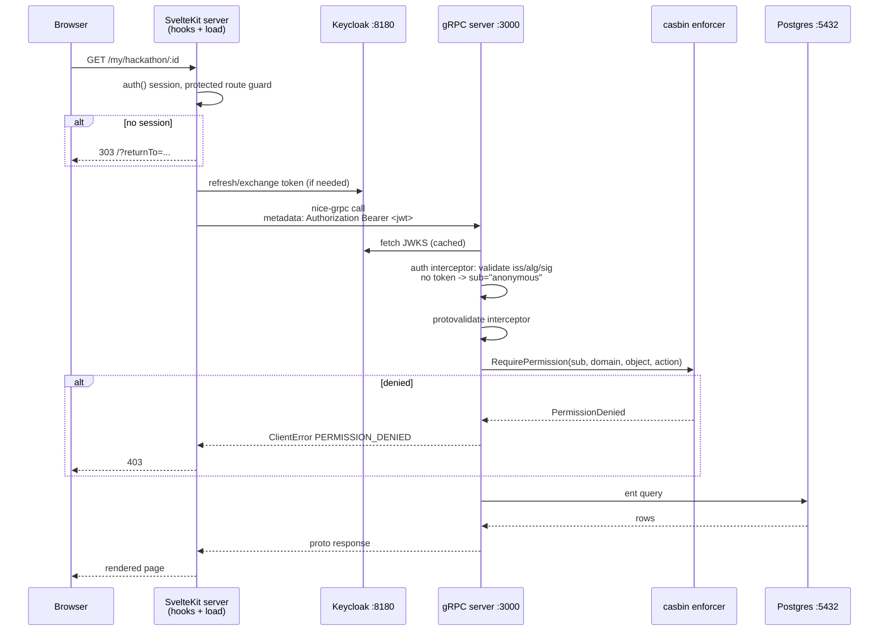

# Architecture

System overview of Hackagon: repository layout, what runs where at development
time, how a browser request reaches Postgres, and how generated code is
produced.

## Monorepo layout

| Path                   | Contents                                                                                                                                                                                                                                      |
| ---------------------- | --------------------------------------------------------------------------------------------------------------------------------------------------------------------------------------------------------------------------------------------- |
| `api/proto/`           | The API contract. One buf module (`buf.yaml`), ~200 `.proto` files, 11 services across four domains: `hackathon`, `user`, `vote`, `health`.                                                                                                   |
| `components/backend/`  | Go gRPC server. `cmd/service/` (entrypoint), `cmd/seed/` (dev fixture), `db/schema/` (hand-written ent schema), `internal/service/` (handlers), `internal/middleware/` (auth + casbin), `ent/` and `internal/proto/` (generated, gitignored). |
| `components/frontend/` | SvelteKit app (Svelte 5, Vite, Tailwind/Skeleton). Server-side gRPC clients in `src/lib/server/grpc/`, generated ts-proto stubs in `src/lib/server/grpc/generated/` (gitignored).                                                             |
| `tools/`               | `nix/` (flake + devenv modules, incl. the process-compose stack in `tools/nix/hackagon/lib/toolchain.nix`), `just/` (justfile modules), `deploy/process-compose/` (stack control), `configs/` (Keycloak realm, linters), `sql/`, `quitsh/`.   |
| `.devcontainer/`       | Docker-compose devcontainer that provides Nix; everything else comes from the flake.                                                                                                                                                          |
| `.claude/skills/`      | Repo-local automation: `devcontainer-up`, `hackathon-e2e`, `cloudflare-tunnel`.                                                                                                                                                               |
| `justfile`             | Root command surface; delegates to the modules in `tools/just/*.just`.                                                                                                                                                                        |

Generated output is not committed. `.gitignore` excludes
`components/backend/internal/proto`, `components/backend/ent/*` and
`components/frontend/src/lib/server/grpc/generated`, so a fresh checkout must
run codegen before it compiles (see [getting-started.md](getting-started.md)).

## Runtime topology

`just start` (or `just deploy::up`) launches the devenv shell
`hackagon.shells.test-services`, whose process-compose stack is defined in
`tools/nix/hackagon/lib/toolchain.nix`. All four processes run on one host —
inside the devcontainer they run inside the single `dev` container; there are no
sidecar service containers.

| Process  | Port | Bind        | Defined in                             | Notes                                                                                                                                                                                                                          |
| -------- | ---- | ----------- | -------------------------------------- | ------------------------------------------------------------------------------------------------------------------------------------------------------------------------------------------------------------------------------ |
| Keycloak | 8180 | `0.0.0.0`   | `toolchain.nix` (`services.keycloak`)  | `dev-file` (H2) database; realm `hackagon` imported from `tools/configs/keycloak/realm-hackagon.json`. Admin console `admin`/`admin`.                                                                                          |
| Postgres | 5432 | `127.0.0.1` | `toolchain.nix` (`services.postgres`)  | PostgreSQL 18, database `hackagon`, role `postgres`/`postgres`. Data in `.devenv/state/postgres`.                                                                                                                              |
| Backend  | 3000 | all         | `toolchain.nix` (`processes.backend`)  | Runs `just develop just run` in `components/backend`; port from `data/test/config/config.yaml`. Readiness probe: `grpcurl -plaintext localhost:3000 health.HealthService/Check`. Depends on Keycloak being healthy.            |
| Frontend | 8081 | `[::1]`     | `toolchain.nix` (`processes.frontend`) | Dev: `just develop just serve` → `vite dev` with `server.port: 8081`, `strictPort: true` (`components/frontend/vite.config.ts`). CI/build mode runs the node build with `ORIGIN`/`PORT` 8081 (`components/frontend/justfile`). |

Port 8081 is also pinned in the Keycloak realm: the `hackagon-frontend` client
declares `redirectUris: ["http://localhost:8081/*"]` and
`webOrigins: ["http://localhost:8081"]`.



Configuration for each component is loaded from a config directory passed with
`--config-dir` (defaults to `./data/test/config/`):

- `components/backend/data/test/config/config.yaml` — server port, admin
  Keycloak ID, DB connection, OIDC JWKS/issuer URLs, log level.
- `components/frontend/data/test/config/config.yaml` — backend host/port, OIDC
  issuer, client id (`hackagon-frontend`), audience (`hackagon-backend`).
- `components/frontend/data/test/config/secrets.yaml` — gitignored dev secrets;
  without it the frontend answers `500 Server Configuration Error`.
- `config.local.yaml` (either component) — **optional, gitignored, partial**
  machine-local overlay, read from the same directory. Precedence is
  `defaults < config.yaml < config.local.yaml < HACKAGON_* env` on the backend
  and `config.yaml < config.local.yaml` on the frontend; both merge key by key
  and validate the merged result, so an overlay naming one key leaves its
  siblings alone and cannot smuggle in an invalid config. Absent is the normal
  case and changes nothing.

  It exists so that pointing this checkout at a machine-specific hostname never
  edits a tracked file. The Cloudflare quick-tunnel wiring
  (`.claude/skills/cloudflare-tunnel/scripts/auth-wire.sh`) writes the tunnel
  issuer here; it used to rewrite `config.yaml` itself, and a hostname that
  dies with the tunnel got committed. `internal/config/config_test.go` asserts
  both tracked configs still name `localhost`.

## Request flow

1. The browser hits a SvelteKit route. `components/frontend/src/hooks.server.ts`
   runs its handle chain: config/logger setup, request-scoped logger, then the
   session handle.
2. Routes are protected by default; only the patterns in `PUBLIC_ROUTE_PATTERNS`
   (`/`, `/hackathon/…`, `/signin`, `/signout`, `/auth/…`, `/error`) are
   anonymous. Protected routes without a session redirect to `/?returnTo=…`.
3. For protected routes, `createAuthorizedGrpc(session.accessToken)`
   (`src/lib/server/grpc/client.ts`) builds nice-grpc clients on the shared
   channel `localhost:3000`, with a middleware that sets the
   `Authorization: Bearer <token>` metadata on every call. Public pages use the
   separate unauthenticated clients (`healthClient`, `publicHackathonClient`,
   `publicPageClient`).
4. The hook then calls `user.whoAmI({})`; on `NOT_FOUND` it auto-registers the
   caller via `user.register({})` and stores the result in
   `event.locals.platformUser`.
5. On the backend, `service.NewServer` (`internal/service/server.go`) installs a
   single unary interceptor chain: **auth** then **protovalidate**.
   - `middleware.AuthUnaryServerInterceptor` validates the bearer token against
     the Keycloak JWKS URL with the configured algorithm and issuer. No token →
     anonymous claims `{sub: "anonymous"}` are injected and the call proceeds;
     an invalid/expired token → `Unauthenticated`. There is no per-endpoint skip
     list.
   - `protovalidate_middleware.UnaryServerInterceptor` enforces the
     protovalidate constraints declared in the protos.
6. Handlers perform authorization themselves — casbin is **not** an interceptor.
   They call `Enforcer.RequirePermission` / `Enforce` / `CheckPermission`
   (`internal/middleware/rbac.go`) with the JWT `sub` as subject and a
   hierarchical domain path (`/hackathon/<id>`, `/hackathon/<id>/team/<id>`,
   `/hackathon/<id>/project/<id>`). See [backend/rbac.md](backend/rbac.md).
7. Authorized handlers query Postgres through the generated ent client and map
   ent rows to proto entities (`internal/service/mappers.go`).
8. gRPC errors travel back to the SvelteKit load function, which translates
   `ClientError` codes into SvelteKit HTTP errors (403/404/…). The backend is
   authoritative for access decisions; the frontend only translates.



## Backend service registration

`components/backend/cmd/service/main.go` loads config, opens the ent client,
runs `dbClient.Schema.Create` (auto-migration), inserts the admin user row for
`server.adminkeycloakid` if missing, then hands off to
`service.NewServer(dbClient, cfg, nil)` and serves on `server.port`.

`internal/service/server.go` constructs the casbin enforcer, the JWT validator,
the interceptor chain, and registers every service — all eleven proto services
have a runtime implementation, plus gRPC reflection:

| Proto service                | Constructor           | Registered as                                 |
| ---------------------------- | --------------------- | --------------------------------------------- |
| `health.HealthService`       | `NewHealthService`    | `health.RegisterHealthServiceServer`          |
| `user.UserService`           | `NewUserService`      | `userSvc.RegisterUserServiceServer`           |
| `hackathon.HackathonService` | `NewHackathonService` | `hackathonSvc.RegisterHackathonServiceServer` |
| `hackathon.PageService`      | `NewPageService`      | `hackathonSvc.RegisterPageServiceServer`      |
| `hackathon.PhaseService`     | `NewPhaseService`     | `hackathonSvc.RegisterPhaseServiceServer`     |
| `hackathon.TrackService`     | `NewTrackService`     | `hackathonSvc.RegisterTrackServiceServer`     |
| `hackathon.ProjectService`   | `NewProjectService`   | `hackathonSvc.RegisterProjectServiceServer`   |
| `hackathon.TeamService`      | `NewTeamService`      | `hackathonSvc.RegisterTeamServiceServer`      |
| `hackathon.ConfigService`    | `NewConfigService`    | `hackathonSvc.RegisterConfigServiceServer`    |
| `hackathon.PrizeService`     | `NewPrizeService`     | `hackathonSvc.RegisterPrizeServiceServer`     |
| `vote.VoteService`           | `NewVoteService`      | `voteSvc.RegisterVoteServiceServer`           |

Every service constructor takes `(dbClient, enforcer)`. Reflection is enabled,
which is what makes `just rpc::as` / `grpcurl` work without descriptor files.

## Codegen

### Protos → Go + TypeScript

`just codegen::proto` (`tools/just/codegen.just`) first removes
`components/backend/internal/proto` and
`components/frontend/src/lib/server/grpc/generated` — `buf generate` does not
prune stale files, and leftovers silently shadow new output — then runs
`buf generate` over the single input directory `api/proto`.

`buf.gen.yaml` drives four plugins:

| Plugin                                                                                                                                                                    | Output                                                               |
| ------------------------------------------------------------------------------------------------------------------------------------------------------------------------- | -------------------------------------------------------------------- |
| `protoc-gen-doc` (`markdown,API.md`)                                                                                                                                      | `api/proto/API.md` (rewritten in place, so `api/proto` is not wiped) |
| `protoc-gen-go` (`paths=source_relative`)                                                                                                                                 | `components/backend/internal/proto/`                                 |
| `protoc-gen-go-grpc`                                                                                                                                                      | `components/backend/internal/proto/`                                 |
| `ts_proto` from `components/frontend/node_modules/.bin` (`outputServices=nice-grpc,outputServices=generic-definitions,esModuleInterop=true,env=node,useExactTypes=false`) | `components/frontend/src/lib/server/grpc/generated/`                 |

Because the ts-proto plugin binary comes from the frontend's `node_modules`,
`pnpm install` must run before `buf generate` in a fresh workspace — that is why
`.devcontainer/bootstrap.sh` orders the steps pnpm → buf → ent → `go mod tidy`.

`buf.yaml` lints with `STANDARD` minus `PACKAGE_VERSION_SUFFIX`, checks
`FILE`-level breaking changes, and depends on `buf.build/bufbuild/protovalidate`
(the constraints enforced by the protovalidate interceptor).

### DB schema → ent + Schema.md

`components/backend/db/schema/*.go` is the hand-written source of truth (20
files: `hackathon`, `participant`, `phase`, `track`, `project`, `team`,
`teamparticipant`, `submission`, `page`, `user`, `vote`, `votecategory`,
`voteresult`, `capability`, `formresponse`, `hackathonforms`, `hackathonprizes`,
`hackathonsettings`, `hackathonwindows`, `mixin`). `just codegen::db-schema`
runs `quitsh generate-schema`, which regenerates `components/backend/ent/**`
(everything except `ent/schema`) and rewrites `components/backend/Schema.md`. At
runtime `dbClient.Schema.Create` applies the schema to Postgres — there are no
migration files.

## Proto layout convention

```
api/proto/
├── <domain>/                          # hackathon, user, vote, health
│   ├── <name>_service.proto           # service definition (RPCs only)
│   ├── entities/                      # nouns: domain types and enums
│   └── messages/<svc>_svc/            # verbs: one request/response per file
│       └── *_request.proto | *_response.proto
```

Concretely, `api/proto/hackathon/` holds eight service files (`hackathon`,
`page`, `phase`, `track`, `project`, `team`, `config`, `prize`) with one
`messages/<svc>_svc/` directory each; `user` and `vote` follow the same shape;
`health` has only `messages/health_svc/`.

The `_svc` suffix is a buf workaround: buf rejects a path segment that collides
with its parent (`hackathon/messages/hackathon/`), so the directory is named
`hackathon/messages/hackathon_svc/`. It means "messages belonging to service X"
and carries no other meaning.

Read/write shape conventions (list responses shallow, get responses deep,
`optional` edit fields, etc.) are documented per service in
[backend/services.md](backend/services.md).

## See also

- [getting-started.md](getting-started.md) — run the topology described here.
- [backend/services.md](backend/services.md) — every RPC behind the request
  flow.
- [backend/data-model.md](backend/data-model.md) — what the ent layer at the
  bottom of the flow stores.
- [glossary.md](glossary.md) — the vocabulary used across these documents.
