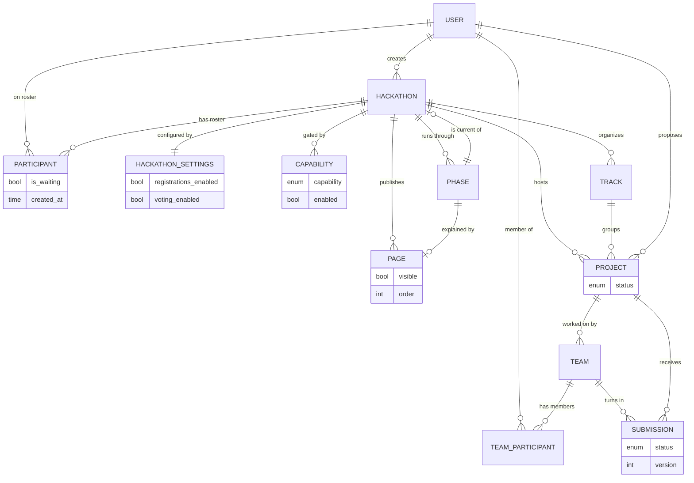

# Backend data model

The database schema is hand-written in `components/backend/db/schema/*.go` using
[ent](https://entgo.io). Those files are the source of truth; everything under
`components/backend/ent/` is generated and must not be edited.

`components/backend/Schema.md` is the auto-generated exhaustive reference —
every column with its type, nullability, uniqueness, immutability and default,
plus every edge with its cardinality. Consult it when you need the exact shape of
a table. This page covers the parts that carry meaning: which fields decide
behaviour, and which edges the handlers actually traverse.

For an interactive, explorable diagram: [`schema.dbml`](schema.dbml) is the
same model in DBML — paste it into [dbdiagram.io](https://dbdiagram.io/d).

Regenerate both the ORM code and `Schema.md` after editing a schema file:

```bash
just codegen::db-schema   # ent codegen + Schema.md
just schema-change        # the full flow: codegen, wipe state, restart, reseed
```

`just codegen::db-schema` shells out to `just quitsh generate-schema` and needs
the Nix dev shell (`just develop`).

## Conventions

Every entity mixes in `UUIDMixin` (`components/backend/db/schema/mixin.go`),
which gives it an immutable UUIDv7 primary key — time-ordered, so insertion
order is recoverable from the ID. Timestamps follow a fixed pattern:
`created_at` is `Immutable().Default(time.Now)` and `modified_at` is
`Default(time.Now).UpdateDefault(time.Now)`. Most content entities carry
`creator` and `modifier` edges back to `User`, almost all annotated
`entsql.OnDelete(entsql.Restrict)` so a user who has authored anything cannot be
deleted out from under it.

`Optional().Nillable()` on a time field means the Go type is `*time.Time` and the
proto field is `optional` — see the mapper conventions in
`components/backend/internal/service/mappers.go`.

## Entity index

| Entity | Schema file | Role |
|---|---|---|
| `User` | `components/backend/db/schema/user.go` | Person, synced from Keycloak |
| `Hackathon` | `components/backend/db/schema/hackathon.go` | The event |
| `HackathonSettings` | `components/backend/db/schema/hackathonsettings.go` | Two feature booleans |
| `HackathonWindows` | `components/backend/db/schema/hackathonwindows.go` | Enforced deadlines |
| `HackathonForms` | `components/backend/db/schema/hackathonforms.go` | Form schemas + voting policy |
| `HackathonPrizes` | `components/backend/db/schema/hackathonprizes.go` | Prize table and awards |
| `Capability` | `components/backend/db/schema/capability.go` | Per-action open/closed gate |
| `Participant` | `components/backend/db/schema/participant.go` | User↔Hackathon roster row |
| `FormResponse` | `components/backend/db/schema/formresponse.go` | One registrant's answers |
| `Page` | `components/backend/db/schema/page.go` | Content page |
| `Phase` | `components/backend/db/schema/phase.go` | Timeline segment |
| `Track` | `components/backend/db/schema/track.go` | Thematic grouping |
| `Project` | `components/backend/db/schema/project.go` | Project proposal |
| `Team` | `components/backend/db/schema/team.go` | Team on a project |
| `TeamParticipant` | `components/backend/db/schema/teamparticipant.go` | User↔Team join row |
| `Submission` | `components/backend/db/schema/submission.go` | Versioned team deliverable |
| `VoteCategory` | `components/backend/db/schema/votecategory.go` | One dimension of evaluation |
| `Vote` | `components/backend/db/schema/vote.go` | One ballot |
| `VoteResult` | `components/backend/db/schema/voteresult.go` | A placement in a category |

## Core diagram



Voting sits on the side of this graph: `Hackathon` → `VoteCategory` →
(`Vote`, `VoteResult`), with `Vote` pointing at a `Submission` and a `User`, and
`VoteResult` pointing at a `Submission`.

---

## User

Key fields: `username`, `keycloak_id` (`NotEmpty().Unique()` — the JWT `sub`,
and the casbin subject), `display_name`, `email`, `created_at`, `modified_at`.

The platform UUID and the Keycloak ID are different identifiers and are used in
different places: casbin always keys on `keycloak_id`, while proto request fields
named `user_id` carry the platform UUID. `UserService.WhoAmI` and
`UserService.Register` re-sync `username`/`display_name`/`email` from the token
claims whenever they drift.

Edges are almost entirely authorship back-references — `created_hackathons`,
`modified_pages`, `created_submissions` and so on, one pair per content entity.
The ones that carry domain meaning:

- `participates_in_hackathons` — through `Participant`.
- `participates_in_teams` — through `TeamParticipant`.
- `preferred_projects` — the M2M written by `ProjectService.SetPreference`.
- `votes` — ballots cast by this user.
- `jury_categories` — M2M to `VoteCategory`. Present, and read by
  `VoteService.SubmitVote` to decide whether the caller may vote in a
  `voter_type=jury` category.
- `form_responses` (responses *about* this user) versus
  `submitted_form_responses` (responses this user *entered*) — distinct so an
  organizer can digitise someone else's paper form.

Roles are **not** in this table. `GlobalRole` and `HackathonRole` come from
casbin, and `UserService.Get`/`WhoAmI` splice them into the response.

## Hackathon

Key fields: `name` (`NotEmpty().Unique()`), `starts_at` / `ends_at` (both
`Optional().Nillable()`), `visibility` (`public` | `private`), `description`,
`logo`, `current_phase_id`, plus timestamps. Indexed on `name`, `starts_at`,
`ends_at`, `visibility`.

There is no `status` column. `HackathonStatus` is derived at read time from
`starts_at`/`ends_at` by `computeHackathonStatus`; `HackathonService.List`
therefore has to apply `status_filter` after the query rather than in SQL.

`current_phase_id` is a plain column on `hackathons`, not a joined edge — the
`current_phase` edge is declared on the inverse side precisely so the FK lands
here and the value can be read without touching the phases table. It is written
by `HackathonService.AdvancePhase` and is `SET NULL` on phase deletion. Nil means
"fall back to deriving the current phase from dates", which is right before an
event and wrong during one, where schedules slip.

One-to-one configuration edges, each `Unique()`: `settings`, `windows`, `forms`,
`prize_table`. One-to-many: `tracks`, `projects`, `pages`, `phases`,
`capabilities`, `vote_categories`, `form_responses`. The roster is
`participating_users` through `Participant`.

## HackathonSettings

`registrations_enabled` and `voting_enabled`, both `Default(false)`, plus
timestamps and a required `modifier`. Created with both flags false by
`HackathonService.Create`; patched by `HackathonService.EditSettings`.

Only `voting_enabled` is actually enforced — `VoteService.SubmitVote` refuses
with `FailedPrecondition` unless a settings row exists and the flag is on.
`registrations_enabled` is stored and editable but **not** consulted: registration
is gated by the `register` capability instead. The merge comment at
`components/backend/internal/service/hackathon_service.go:330` documents this as
a deliberate, temporary resolution of two contradictory gating mechanisms.

## HackathonWindows

Deadlines, all `Optional().Nillable()`: `registration_opens`,
`registration_closes`, `proposals_close`, `preferences_close`,
`submissions_close`, plus two one-shot extensions —
`registration_override_until` and `submissions_override_until` — and a free-text
`late_policy`.

Enforced by `requireWindowOpen`
(`components/backend/internal/service/config_service.go`). No row, or an unset
instant, means no enforcement. Only registration and submissions honour an
override; proposals and preferences close hard. Written by
`ConfigService.SetWindows` (upsert) and `ConfigService.OverrideWindow`, which
anchors the extension at *now* rather than at the configured close.

## HackathonForms

Four JSON columns, all optional: `registration_fields` and
`registration_consents` (`{key,label,type,required,maxMb}` /
`{key,label,required}`), `submission_fields`, and `voting_policy`
(mechanism, scale, tie-breaks). Written by `ConfigService.SetRegistrationForm`,
`SetSubmissionForm` and `SetVotingPolicy`.

`registration_fields` and `registration_consents` are the schema that
`HackathonService.SubmitRegistrationForm` validates responses against.
`submission_fields` and `voting_policy` are stored but not read by any
enforcement path yet.

## HackathonPrizes

`prizes` JSON (`[{rank, title}]`, rank 0 meaning a special prize), `awards` JSON
(`[{rank|special, submissionId}]`), and `finalized` (`Default(false)`).

Votes are advisory until an organizer runs `PrizeService.Finalize`, which writes
`awards` and flips `finalized`. The table stays editable afterwards via
`PrizeService.Edit`.

## Capability

`capability` — an `Immutable()` enum over `register`, `propose_projects`,
`set_team_preferences`, `create_project_submissions`, `vote`, `view_results` —
and `enabled` (`Default(false)`). Unique on `(capability, hackathon)`, so a
double-create cannot produce two rows disagreeing about whether an action is
open.

`enabled` is the authoritative gate. The two phase edges, `open_in_phase` and
`closed_in_phase`, are **display and scheduling only** and never change `enabled`
by themselves; both are `SET NULL` on phase deletion so deleting a phase from the
owner UI cannot delete the capability with it. A capability with no
`open_in_phase` is purely manual, which is what keeps voting immune to
`AdvancePhase`.

`HackathonService.Create` pre-creates all six rows with `enabled=true`
(`defaultCapabilityEnabled` in
`components/backend/internal/service/capability.go`), so editing is always a
plain update and never an upsert, and a new hackathon states its policy
explicitly instead of being ambiguously ungoverned.

State resolution lives in `components/backend/internal/capability/capability.go`:
`enabled` → `OPEN`; otherwise pending (by phase position when an organizer has
advanced, else by date) → `COMING`; else `CLOSED`. A capability with no row at
all reports `UNGOVERNED`, and `States.Allowed` treats `UNGOVERNED` as permissive.

## Participant

The `users`↔`hackathons` join, carrying `is_waiting` (`Default(true)`) and
`created_at` (the join time, surfaced as `HackathonMember.joined_at`). The
schema annotates a composite `field.ID("user_id", "hackathon_id")` alongside the
mixin's UUID key.

`is_waiting` is the roster's confirmed/waitlisted distinction and it is what
gates the sensitive paths, not the casbin role:

- `HackathonService.Join` inserts `is_waiting=true` **and** grants the casbin
  `member` role, so a waitlisted registrant can propose projects and see the
  private hackathon they signed up for.
- `HackathonService.ApproveParticipant` flips it to `false`.
- `HackathonService.Get` refuses anyone still waiting (`viewerMayOpenMemberView`).
- `VoteService.SubmitVote` requires `is_waiting=false`.
- `ProjectService.SetPreference` accepts waitlisted users — preferences are
  expressed before the roster cut.
- `HackathonService.Create` inserts the creator with `is_waiting=false`, because
  membership is read from this table and an owner absent from it would be
  invisible on their own roster and dashboard.

## FormResponse

`responses` JSON (answers keyed by field key) and `consents` JSON
(`map[string]bool`). Unique on `(hackathon, user)`, so a second submission
becomes `AlreadyExists`. Three required edges: `hackathon`, `user` (whom the
response is about) and `submitted_by` (who typed it in).

## Page

`title`, `content` (text), `visible` (`Default(true)`), `order` (int), indexed on
both `order` and `visible`.

`order` is a dense `0..n-1` sequence maintained entirely server-side —
`PageService.Create` appends at `max+1`, and `Delete`, `MoveUp`, `MoveDown` and
`SetOrder` renumber the whole set in a transaction. `visible=false` hides the
page from anyone without `page`/`write`, in both `List` and `Get`.

A page optionally belongs to a `phase` (the inverse of `Phase.page`); that link
is managed from the phase side.

## Phase

`name`, `description`, `starts_at` / `ends_at` (both `Optional().Nillable()`),
indexed on `starts_at`, `ends_at`, `name`.

Phases are ordered by `starts_at` with the ID as tiebreaker and undated phases
last (`phaseOrderFrom` in
`components/backend/internal/service/capability.go`), matching Postgres'
`NULLS LAST` default so the query form and the slice form agree. That ordering is
what `AdvancePhase` compares positions against.

Edges: `page` (at most one), `opens_capabilities` / `closes_capabilities` (the
display-only schedule), and `current_of` — the hackathon currently sitting in
this phase.

## Track

`name` and a required `description`. Unique on `(name, hackathon)`. Groups
projects; a project's track is optional.

## Project

`title`, `description`, `image`, and `status`, an enum over `proposed` |
`approved` (indexed, along with `title`).

`ProjectService.Propose` writes `proposed` and grants the proposer a casbin
`owner` role on `/hackathon/<id>/project/<projectID>`; `Approve` and `Disapprove`
move the enum between the two values.

Edges: required `hackathon`, optional `track`, required `creator`/`modifier`,
plus `teams`, `submissions`, and `preferred_by_users` — the M2M written by
`SetPreference` and read back by `ExportPreferences`.

## Team

`name` and an optional `description`. Required `project` edge (teams hang off
projects, not directly off hackathons — every handler resolves
team → project → hackathon), required immutable `creator`, optional `modifier`,
`submissions` (cascade on delete) and `members` through `TeamParticipant`.

## TeamParticipant

The `users`↔`teams` join: `team_id`, `user_id`, `created_at`, both edges
cascading on delete. Written alongside a casbin `member` grant on the team domain
by `TeamService.AssignUser`.

## Submission

`result` (optional — typically a URL), `status` (`draft` | `final`), and
`version` (`Positive()`), unique on `(version, project, team)`.

Versioning is per project-and-team, computed by `TeamService.CreateSubmission` as
`count(existing) + 1`; the unique index is what stops two concurrent creates
sharing a number. New submissions are always `draft`.
`TeamService.FinalizeSubmission` moves the status to `final`, after which
`EditSubmission` refuses to touch it — finalized submissions are frozen.

Edges: required `team`, `project` and `creator`; optional `modifier`; plus
`votes` and `vote_results` pointing back from the voting tables.

## VoteCategory

`name`, `description`, and two enums: `voting_method` (`single_choice` | `ranked`
| `points`) and `voter_type` (`all_participants` | `jury`).

Edges: required `hackathon`, `jury_members` (M2M to `User`, the inverse of
`User.jury_categories`, meaningful only when `voter_type=jury`), `votes`, and
`results`.

## Vote

One atomic judgment: `vote_type` (`single_choice` | `ranked` | `points`) and an
optional `value` (rank position or points awarded). **Unique on
`(category, voter)`** — one ballot per voter per category, which is what turns a
double vote into `AlreadyExists`.

A schema hook, `ValidateVoteType`, enforces that the subtype fields match the
discriminator: every type requires a submission, and `ranked`/`points`
additionally require a positive `value`.

Because the table stores one row per `(category, voter)`, ranked and points
ballots — which need several rows — cannot be persisted yet;
`VoteService.SubmitVote` accepts only `single_choice`. The schema carries no
timestamp columns, so the `created_at`/`modified_at` fields on the proto entity
are always zero.

## VoteResult

A placement within a category: `position` (1 = first; **not** unique, so ties are
allowed) and an optional `title` for a named award. Required edges to
`vote_category` and `submission`. Written by organizers through
`CreateVoteResult`/`EditVoteResult` rather than computed from the ballots.

## See also

- [services.md](services.md) — the handlers that read and mutate these tables.
- [rbac.md](rbac.md) — casbin rows live outside this model, in `casbin_rule`.
- [schema.dbml](schema.dbml) — the same model as DBML, for an interactive
  diagram.
- [../glossary.md](../glossary.md) — what each entity is called in prose.
