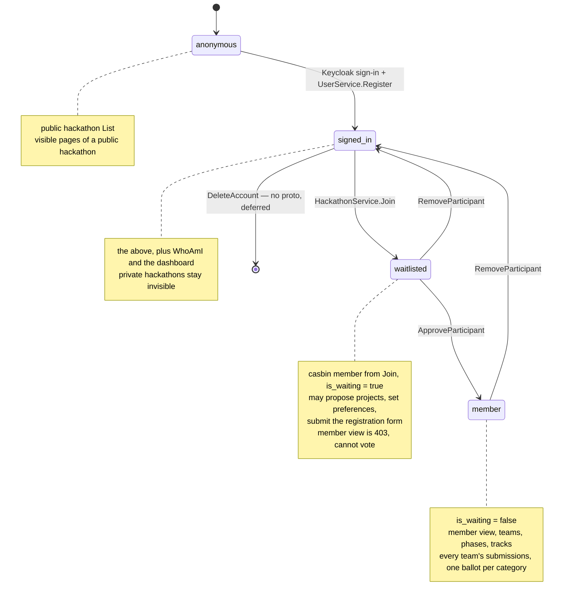

# Authorization (casbin RBAC)

How Hackagon decides who may do what. Everything here is verified against
branch `sketch/06-08-26`.

Source of truth:

| Concern                        | File                                                     |
| ------------------------------ | -------------------------------------------------------- |
| Enforcer, roles, domains, rules | `components/backend/internal/middleware/rbac.go`         |
| The casbin model                | `components/backend/internal/middleware/casbin_model.conf` (embedded via `go:embed`) |
| JWT parsing / anonymous subject | `components/backend/internal/middleware/auth.go`         |
| Enforcer + interceptor wiring   | `components/backend/internal/service/server.go`          |
| Dev-data role grants            | `components/backend/cmd/seed/main.go`                    |

The backend is authoritative for every access decision. The frontend only
translates gRPC status codes into HTTP responses.

## The subject is the Keycloak ID

Every casbin request uses the JWT `sub` claim — the Keycloak user ID — as the
subject, never the platform's DB UUID (`user.id`).

The reason is cost: `sub` is already in the bearer token, so the interceptor
can answer an authorization question without touching the database. Using the
DB UUID would force a `users` lookup on every request before casbin could even
be consulted. The consequence is that grouping rows (`g`, `g2`) store Keycloak
IDs, while proto/DB payloads carry DB UUIDs — handlers that need both resolve
one from the other explicitly (see `HackathonService.ApproveParticipant`, which
takes a DB `user_id` and then reads `user.KeycloakID` to write the casbin row).

## The auth interceptor

`AuthUnaryServerInterceptor` runs for **every** RPC — there is no per-endpoint
skip list and no "optional auth" mode.

| Incoming `authorization` metadata | Result                                                                |
| --------------------------------- | --------------------------------------------------------------------- |
| absent / empty                     | claims `{sub: "anonymous"}` injected into the context; request proceeds |
| present but invalid or expired     | `Unauthenticated` returned; handler never runs                          |
| present and valid                  | the real Keycloak claims stored in the context                          |

`AnonSubject` is the literal string `"anonymous"` (`auth.go`). Casbin treats it
as an ordinary unprivileged subject, so it matches only wildcard (`p.sub == "*"`)
rules. Endpoints that serve anonymous callers work because of that, not because
they are exempted. The health endpoint works because it never reads claims.

Helpers available to handlers: `GetClaims`, `GetSubject`, and `RequireSubject`
(which returns `Unauthenticated` when claims or `sub` are missing).

## The casbin model

`casbin_model.conf`:

```conf
[request_definition]
r = sub, domain, obj, act

[policy_definition]
p = sub, domain, obj, act

[role_definition]
g  = _, _, _     # (user, role, domain)  — per-hackathon role assignment
g2 = _, _        # (user, role)          — global role assignment

[policy_effect]
e = some(where (p.eft == allow))

[matchers]
m = (g(r.sub, p.sub, r.domain) || p.sub=="*")
    && globMatch(r.domain, p.domain)
    && r.obj == p.obj && r.act == p.act
    || g2(r.sub, "admin")
```

Reading the matcher left to right:

1. `g(r.sub, p.sub, r.domain)` — the caller holds the policy's role **in the
   requested domain**; or `p.sub == "*"`, which makes the rule apply to
   everyone including anonymous.
2. `globMatch(r.domain, p.domain)` — the policy's domain may be a glob, which
   is what lets one rule cover every hackathon (`/hackathon/*`) and every team
   (`/hackathon/*/team/*`).
3. object and action must match exactly.
4. `|| g2(r.sub, "admin")` — the **admin escape hatch**. A subject with a
   global `admin` role short-circuits the whole expression and is allowed
   everything, everywhere. `admin` is the only global role the matcher knows
   about by name.

Note that `g` lookups are exact string compares on the domain — no domain
matching function is registered for `g`. A `g` row scoped to the literal
`/hackathon/*` therefore cannot satisfy a request scoped to a concrete
`/hackathon/<uuid>`; only the `p` side globs.

### Domains are paths

`rbac.go` builds hierarchical domain strings:

| Helper                      | Shape                                 |
| --------------------------- | ------------------------------------- |
| `hackathonIdToPath(id)`     | `/hackathon/<id>`                     |
| `projectDomainPath(d, pid)` | `/hackathon/<id>/project/<projectId>` |
| `teamDomainPath(d, tid)`    | `/hackathon/<id>/team/<teamId>`       |

Handlers select the deeper domains with the `WithProject(...)` /
`WithTeam(...)` `EnforceOption`s, so that a rule written for "a hackathon
owner" and a rule written for "a member of this one team" can both match the
same call.

### Objects and permissions

`ObjectType`: `hackathon`, `page`, `phase`, `track`, `project`, `team`,
`submission`, `user`. `user` is a dummy entry — there are no `p` rules for it,
so `Enforce(..., User, Read)` can only ever succeed through the admin escape
hatch. That is exactly how `UserService.List` / `Get` become admin-only.

`Permission`: `read`, `write`, `create`, `propose`.

## The three policy row types

The casbin ent adapter stores everything in one table with generic columns
`v0`–`v5`. `v4`/`v5` are always null: the adapter schema is fixed regardless of
how many fields the model actually uses.

| `ptype` | Meaning                     | v0             | v1              | v2                 | v3       | v4/v5 |
| ------- | --------------------------- | -------------- | --------------- | ------------------ | -------- | ----- |
| `p`     | permission rule             | role (or `*`)  | domain (glob)   | object type        | action   | null  |
| `g`     | per-hackathon role grant    | Keycloak ID    | role            | domain path        | —        | null  |
| `g2`    | global role grant           | Keycloak ID    | role            | —                  | —        | null  |

### The `p` rules shipped at startup

`defaultPolicies` in `rbac.go` writes this set on every enforcer construction
(casbin's `AddPolicies` is idempotent):

| Role       | Domain                     | Object     | Action    |
| ---------- | -------------------------- | ---------- | --------- |
| `hackathon_organizer` | `/hackathon/*`  | hackathon  | create    |
| `owner`    | `/hackathon/*`             | hackathon  | read, write |
| `owner`    | `/hackathon/*`             | page       | read, write |
| `owner`    | `/hackathon/*`             | phase      | read, write |
| `owner`    | `/hackathon/*`             | track      | read, write |
| `owner`    | `/hackathon/*`             | project    | read, write, propose |
| `owner`    | `/hackathon/*/project/*`   | project    | write     |
| `owner`    | `/hackathon/*`             | team       | create, write |
| `owner`    | `/hackathon/*`             | submission | read      |
| `member`   | `/hackathon/*`             | hackathon  | read      |
| `member`   | `/hackathon/*`             | page       | read      |
| `member`   | `/hackathon/*`             | phase      | read      |
| `member`   | `/hackathon/*`             | track      | read      |
| `member`   | `/hackathon/*`             | project    | read, propose |
| `member`   | `/hackathon/*`             | submission | read      |
| `member`   | `/hackathon/*/team/*`      | team       | write     |
| `member`   | `/hackathon/*/team/*`      | submission | create, write, read |

Two consequences worth stating explicitly:

- **Members read every team's submission**, hackathon-wide — the
  `member, /hackathon/*, submission, read` row. Demo day and voting both
  require seeing what the other teams turned in.
- **Team-scoped write** is what separates "member of the hackathon" from
  "member of this team": editing a team or its submissions needs the
  `/hackathon/<id>/team/<teamId>` domain, which only assigned team members hold.

## Roles and how they are granted

| Role                  | Table | Scope           | Granted by |
| --------------------- | ----- | --------------- | ---------- |
| `admin`               | `g2`  | everything      | Bootstrapped at startup from `cfg.Server.AdminKeycloakID`: `defaultPolicies` writes `g2, <AdminKeycloakID>, admin` on every enforcer construction. No RPC grants it. |
| `hackathon_organizer` | `g2` + `g` | create hackathons | `Enforcer.AddGlobalRole`. Only caller in production code is the dev seeder (`cmd/seed/main.go` grants it to `alice`). |
| `owner`               | `g`   | one hackathon   | `HackathonService.Create` — the creator becomes `owner` of the new hackathon (`hackathon_service.go:118`). |
| `owner`               | `g`   | one project     | `ProjectService.Propose` — the proposer becomes `owner` of the project domain (`project_service.go:232`); revoked by `ProjectService.Delete`. |
| `member`              | `g`   | one hackathon   | `HackathonService.Join` (`hackathon_service.go:387`) **and** `ApproveParticipant` (`:473`); revoked by `RemoveParticipant` (`:559`). |
| `member`              | `g`   | one team        | `TeamService.AssignUser` (`team_service.go:345`); revoked by `RemoveUser` (`:401`). |

**Join grants `member` on this branch.** This is the answer to the question the
older docs left open: everyone on the roster holds the casbin `member` role
from the moment they register, and the approved/waitlisted distinction is
carried entirely by the `participants.is_waiting` column — not by casbin. This
is deliberate (see the comment at `hackathon_service.go:383`): it lets
waitlisted registrants propose projects, set preferences and see the private
hackathon they signed up for, while the sensitive paths keep their own
`is_waiting` checks.

`AddGlobalRole` deliberately writes **both** tables:

- `g2 (user, role)` — what `GetGlobalRoles`, and therefore `UserService.WhoAmI`,
  reports.
- `g (user, role, "/hackathon/*")` — what the matcher can actually enforce,
  because the model consults `g2` only through the hard-coded
  `g2(r.sub, "admin")` clause. A `g2` row alone leaves every role other than
  `admin` unenforceable.

`Role.IsGlobal()` rejects granting `owner`/`member` globally
(`ErrNotAGlobalRole`) — those describe standing in one hackathon.

`user.UserService/AddRole` and `RemoveRole` exist in the proto but have **no
handler** on this branch; they return `Unimplemented`. Role changes today come
only from the handlers in the table above and from the seeder.

## Error codes

`Enforcer.RequirePermission` is the wrapper handlers should use. On denial it
distinguishes:

| Caller                                | Code                |
| ------------------------------------- | ------------------- |
| `sub == "anonymous"`                  | `Unauthenticated`   |
| authenticated but unauthorized        | `PermissionDenied`  |
| enforcer error (adapter/model failure)| `Internal`          |

Handlers with hand-written anonymous checks (`Join`, `ApproveParticipant`,
`RemoveParticipant`, `VoteService.SubmitVote`) return `Unauthenticated` for the
same reason, so every endpoint speaks the same dialect.

## Public visibility

`AllowPublicHackathonAccess(id)` writes a wildcard permission row —
`p, *, /hackathon/<id>, hackathon, read` — and `RemovePublicHackathonAccess`
deletes it. Because `p.sub == "*"` short-circuits the role lookup in the
matcher, that single row makes the hackathon readable by anyone, anonymous
callers included.

**On this branch nothing calls either function outside
`middleware/rbac_test.go`.** No handler writes the wildcard row when a
hackathon is created, and no handler adds or removes it when
`HackathonService.Edit` flips `visibility`. Public access is instead
implemented by explicit `visibility == public` checks in the handlers:

| Handler                    | How "public" is honoured                                                                                 |
| -------------------------- | -------------------------------------------------------------------------------------------------------- |
| `HackathonService.List`    | Public hackathons are always returned. Private ones are filtered per-row by `Enforce(hackathon, read)`, which anonymous callers always fail. Flipping `visibility` is therefore what changes public listing — immediately, with no casbin write. |
| `PageService.List`         | If the `Page:read` check fails, the handler re-queries the hackathon and serves the page list anyway when `visibility == public` (`page_service.go:45-54`). Hidden pages (`visible == false`) still require `Page:write`. |
| everything else            | Nothing. `HackathonService.Get`, `PageService.Get`, `Phase`, `Track`, `Project`, `Team` all require a real casbin grant regardless of visibility. |

So today: a public hackathon is *listable* and its visible *pages* are
readable anonymously; its detail tree is not. That is what makes the public
marketing route `src/routes/(public)/hackathon/[id]/+page.server.ts` work —
it uses an unauthenticated `publicPageClient` and tolerates failure.

If the wildcard-row mechanism is ever wired up, the flip points are
`HackathonService.Create` (add the row for `VISIBILITY_PUBLIC`) and
`HackathonService.Edit` (add/remove when `visibility` changes).

## Two gates that are not casbin

Authorization answers "may this user ever do this". Two further gates answer
"is it open right now"; both live outside casbin and are documented in
`docs/lifecycle.md`.

| Gate | Where | Organizer bypass? |
| ---- | ----- | ----------------- |
| **Capabilities** (`register`, `propose_projects`, `set_team_preferences`, `create_project_submissions`, `vote`, `view_results`) | `requireCapability` in `internal/service/capability.go` | **Yes** — anyone passing `Hackathon:write` skips the gate entirely, so organizers can fix things outside the window. |
| **Time windows** (`registration`, `proposals`, `preferences`, `submissions`) | `requireWindowOpen` in `internal/service/config_service.go` | **No** — organizers bounce too, and must call `ConfigService.OverrideWindow` (registration and submissions only). |

Both return `FailedPrecondition`, never `PermissionDenied`.

## Persona × capability matrix

Personas as they exist on this branch:

- **anonymous** — no bearer token; `sub == "anonymous"`.
- **signed-in** — valid token, no participant row and no role in this hackathon.
- **waitlisted** — participant row with `is_waiting = true`, plus the casbin
  `member` role granted at `Join`.
- **member** — participant row with `is_waiting = false`, casbin `member`.
- **owner** — casbin `owner` in this hackathon (the creator, or a seeded grant).
- **admin** — `g2 … admin`; passes the matcher's escape hatch on everything.

The first four are states one person moves through, not separate kinds of user:



`Join` moves a person to *waitlisted*, and `ApproveParticipant` flips
`is_waiting`; both grant the same casbin `member` role, so the two states differ
only in the two hand-written checks named at the end of this section.
`RemoveParticipant` deletes the row and revokes the role, returning the person
to *signed-in* — it does not clear their team seat. `owner` and `admin` are not
on this path: they are grants that sit alongside it. The exit to `[*]` is drawn
from *signed-in* only because `DeleteAccount` has no proto yet — whether it also
purges roster rows and `g`/`g2` grants is open decision 7 in
[../lifecycle.md](../lifecycle.md).

`✓` = allowed, `✗` = denied, `⚠` = authorization passes, but the call is
additionally subject to a capability/window gate or a non-casbin check and can
still fail with `FailedPrecondition` (see `docs/lifecycle.md`).

| Operation | Authorization check | anon | signed-in | waitlisted | member | owner | admin |
| --------- | ------------------- | :--: | :-------: | :--------: | :----: | :---: | :---: |
| `HackathonService.List` (public) | none | ✓ | ✓ | ✓ | ✓ | ✓ | ✓ |
| `HackathonService.List` (private) | per-row `hackathon:read` | ✗ | ✗ | ✓ | ✓ | ✓ | ✓ |
| `HackathonService.Get` | `hackathon:read` **and** confirmed participant / owner / admin | ✗ | ✗ | ✗ | ✓ | ✓ | ✓ |
| `HackathonService.Create` | `hackathon:create` on `/hackathon/*` | ✗ | ✗¹ | ✗¹ | ✗¹ | ✗¹ | ✓ |
| `HackathonService.Edit` / `Delete` / `EditSettings` / `EditCapability` / `AdvancePhase` | `hackathon:write` | ✗ | ✗ | ✗ | ✗ | ✓ | ✓ |
| `HackathonService.Join` | authenticated, not anonymous | ✗ | ⚠ | ⚠² | ⚠² | ⚠ | ⚠ |
| `HackathonService.ApproveParticipant` / `RemoveParticipant` | `hackathon:write` | ✗ | ✗ | ✗ | ✗ | ✓ | ✓ |
| `HackathonService.SubmitRegistrationForm` (self) | authenticated | ✗ | ✓ | ✓ | ✓ | ✓ | ✓ |
| `HackathonService.SubmitRegistrationForm` (`on_behalf_of`) | `hackathon:write` | ✗ | ✗ | ✗ | ✗ | ✓ | ✓ |
| `PageService.List` | `page:read`, **or** hackathon is public | ✓³ | ✓³ | ✓ | ✓ | ✓ | ✓ |
| `PageService.Get` | `page:read`; hidden pages need `page:write` | ✗ | ✗ | ✓ | ✓ | ✓ | ✓ |
| `PageService` mutations | `page:write` | ✗ | ✗ | ✗ | ✗ | ✓ | ✓ |
| `PhaseService` / `TrackService` reads | `phase:read` / `track:read` | ✗ | ✗ | ✓ | ✓ | ✓ | ✓ |
| `PhaseService` / `TrackService` mutations | `phase:write` / `track:write` | ✗ | ✗ | ✗ | ✗ | ✓ | ✓ |
| `ProjectService.List` / `Get` | `project:read` | ✗ | ✗ | ✓ | ✓ | ✓ | ✓ |
| `ProjectService.Propose` | `project:propose` + capability + window | ✗ | ✗ | ⚠ | ⚠ | ⚠ | ⚠ |
| `ProjectService.Approve` / `Disapprove` / `ExportPreferences` | `project:write` | ✗ | ✗ | ✗ | ✗ | ✓ | ✓ |
| `ProjectService.Edit` / `Delete` | `project:write` at `/…/project/<id>`, else at hackathon level | ✗ | ✗ | ✓⁴ | ✓⁴ | ✓ | ✓ |
| `ProjectService.SetPreference` | **no casbin check** — any participant row + capability + window | ✗ | ✗ | ⚠ | ⚠ | ⚠⁵ | ⚠⁵ |
| `TeamService.List` / `Get` | `hackathon:read` | ✗ | ✗ | ✓ | ✓ | ✓ | ✓ |
| `TeamService.Create` | `team:create` | ✗ | ✗ | ✗ | ✗ | ✓ | ✓ |
| `TeamService.Edit` | `team:write` at team domain, else hackathon | ✗ | ✗ | ✗ | ✓⁶ | ✓ | ✓ |
| `TeamService.Delete` / `AssignUser` / `RemoveUser` | `team:write` at hackathon domain | ✗ | ✗ | ✗ | ✗ | ✓ | ✓ |
| `TeamService.CreateSubmission` | `submission:create` at team domain + window + capability | ✗ | ✗ | ✗ | ✓⁶ | ⚠ | ⚠ |
| `TeamService.EditSubmission` / `FinalizeSubmission` | `submission:write` at team domain (+ window / capability) | ✗ | ✗ | ✗ | ✓⁶ | ⚠ | ⚠ |
| `TeamService.GetSubmission` / `ListSubmissions` | `submission:read` at team domain, else hackathon | ✗ | ✗ | ✓ | ✓ | ✓ | ✓ |
| `VoteService.SubmitVote` | authenticated + `voting_enabled` + **not** owner/admin + confirmed participant (+ jury membership for jury categories) | ✗ | ✗ | ✗ | ✓ | ✗ | ✗ |
| `VoteService` category/result reads | authenticated only (`TODO: casbin`) | ✗ | ✓ | ✓ | ✓ | ✓ | ✓ |
| `VoteService` category/result mutations, `ListVotes`, `ExportVotes`, `ExportResults` | `hackathon:write` | ✗ | ✗ | ✗ | ✗ | ✓ | ✓ |
| `ConfigService.*` | `hackathon:write` | ✗ | ✗ | ✗ | ✗ | ✓ | ✓ |
| `PrizeService.Set` / `Finalize` / `Edit` | `hackathon:write` | ✗ | ✗ | ✗ | ✗ | ✓ | ✓ |
| `UserService.List` / `Get` | `user:read` → admin escape hatch only | ✗ | ✗ | ✗ | ✗ | ✗ | ✓ |
| `UserService.WhoAmI` / `Register` | authenticated | ✗ | ✓ | ✓ | ✓ | ✓ | ✓ |

¹ Unless the caller also holds the global `hackathon_organizer` role, which is
orthogonal to standing in any one hackathon.
² A second `Join` by someone already on the roster returns success without
changing anything — but only if the capability and window gates still pass,
because they run before the already-a-participant check.
³ Only for a hackathon whose `visibility` is `PUBLIC`, and only its
`visible == true` pages.
⁴ Only for a project the caller proposed (they hold `owner` on that project's
domain).
⁵ `SetPreference` requires a participant row, which an owner/admin only has if
they registered or created the hackathon (`Create` inserts one for the creator).
⁶ Only for a team the caller is assigned to.

**Waitlisted ≈ member for pure-casbin checks.** Because `Join` grants the
`member` role, the only places where waitlisting actually bites are the two
hand-written checks: `viewerMayOpenMemberView` in `HackathonService.Get`, and
the confirmed-participant check in `VoteService.SubmitVote`.

## Operational gotchas

**The enforcer loads the policy once, at startup, and never reloads.**
`NewRBACEnforcer` calls `LoadPolicy()`, merges the default rules, then
`SavePolicy()`. There is no watcher, no auto-load, and no refresh RPC. Rows
written to the `casbin_rule` table by a *different* process — most importantly
`cmd/seed`, which constructs its own enforcer — are invisible to the running
backend until it restarts. Symptoms: membership badges render wrong, private
hackathons vanish from listings, seeded owners get `PermissionDenied`. The e2e
harness works around it explicitly:

```bash
just db::seed
just deploy::proc-comp process restart backend    # reload seeded casbin roles
```

(see `.claude/skills/hackathon-e2e/scripts/seed.sh`). Grants written by the
backend's *own* handlers are fine — they go through the in-memory enforcer.

**Role changes are not transactional with the DB.** `HackathonService.Create`
compensates by hand (delete the hackathon, remove the role) when a later step
fails; `TeamService.AssignUser` only logs a failed casbin write and still
returns success. A casbin row and its DB counterpart can therefore diverge
under partial failure.

**`Enforce` needs claims in the context.** It returns
`errors.New("no claims in context")` — which `RequirePermission` maps to
`Internal` — if called outside the interceptor chain. Use
`CheckPermission(subject, …)` for the JWT-free path.

**Debugging.** Set `logging.level: debug` in the backend config and casbin logs
every matcher evaluation to stderr. `Enforcer.ListG2Policies()` dumps the global
role grants.

## See also

- [services.md](services.md) — which check each RPC actually performs.
- [../lifecycle.md](../lifecycle.md) — the other two gates (capabilities, time
  windows) and the policy decisions behind them.
- [../frontend/routes-and-auth.md](../frontend/routes-and-auth.md) — how these
  denials become 401/403 pages.
- [data-model.md](data-model.md) — `participants.is_waiting`, the column that
  casbin deliberately does not model.
