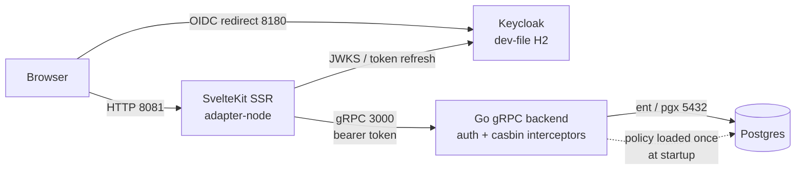

# Infrastructure — today, target, and a paperdraw build sheet

Two topologies live here: **what runs today** (a single-host dev stack, verified
against the repo) and **what production would need**, expressed so it can be
built and stress-tested in [paperdraw.dev](https://paperdraw.dev) — a
drag-and-drop system-design _simulator_ (traffic + chaos injection), not a
diagram-as-code tool. There is no text format to import reliably: build the
nodes from the table below, then run the load profiles at the end.

## Today — single-host dev stack

The application runs in one process-compose supervisor, on one machine (or one
devcontainer). No replicas, no load balancer, no cache, no queue. Object storage
does exist now, but only as a dev container (`rustfs`, S3-compatible) that
nothing in the app reads yet — the storage layer is provisioned and proven, the
upload path is not built.

| Process               | Port                      | Notes                                                                                     |
| --------------------- | ------------------------- | ----------------------------------------------------------------------------------------- |
| SvelteKit frontend    | 8081                      | SSR; the only gRPC client — acts as the BFF                                               |
| Go gRPC backend       | 3000                      | stateless _except_ the in-memory casbin policy                                            |
| Keycloak              | 8180                      | realm imported from `tools/configs/keycloak/realm-hackagon.json`; **H2 dev-file storage** |
| Postgres              | 5432                      | app data + the casbin policy table                                                        |
| RustFS (object store) | 9000 (S3), 9001 (console) | own container, not process-compose; bucket `hackagon-dev`; dev-only credentials           |

## Target — what production needs (and what to simulate)

Four things must change before this scales past one box. Each is a node (or a
missing node) in the paperdraw model:

| #   | Gap today                                                                                                                                                                                        | Production need                                                                                                                                                                                                                                                                                |
| --- | ------------------------------------------------------------------------------------------------------------------------------------------------------------------------------------------------ | ---------------------------------------------------------------------------------------------------------------------------------------------------------------------------------------------------------------------------------------------------------------------------------------------- |
| I1  | **casbin policy is loaded once at startup and never reloads** (already causing the seed-then-restart workaround in the e2e suite)                                                                | With 2+ backend replicas, a role granted on replica A is invisible to replica B until restart. Needs a policy watcher (Redis/Postgres LISTEN) or a single-writer/sticky arrangement. **This is the blocker for horizontal scaling.**                                                           |
| I2  | Keycloak on H2 dev-file                                                                                                                                                                          | Keycloak with its own Postgres (or managed OIDC)                                                                                                                                                                                                                                               |
| I3  | Frontend hard-codes `localhost:3000` (`TODO.md` F7)                                                                                                                                              | Backend address from config → frontend and backend deployable separately                                                                                                                                                                                                                       |
| I4  | No queue. Object storage exists **in dev only**: an S3-compatible RustFS container (`rustfs`, see `.devcontainer/README.md`), single drive, zero parity, plaintext HTTP, credentials as literals | A managed bucket (S3 or MinIO/RustFS run properly): TLS, credentials from a secret store or workload identity, private bucket + presigned URLs, versioning and lifecycle rules, cross-AZ durability. Queue for the notification service is still absent — a deferred feature from `roadmap.md` |

### paperdraw build sheet

Drag these nodes and wire them in this order. Parameters are starting points for
an event of ~100 participants (SDSC's announced capacity).

| #   | paperdraw node                    | Represents                        | Suggested config                                                                |
| --- | --------------------------------- | --------------------------------- | ------------------------------------------------------------------------------- |
| 1   | Client / traffic source           | Participants + anonymous visitors | see load profiles below                                                         |
| 2   | Load balancer                     | TLS terminator / ingress          | round-robin, health checks                                                      |
| 3   | Web/App server ×2                 | SvelteKit SSR (BFF)               | stateless, scale freely; SSR renders every page                                 |
| 4   | API gateway _(optional)_          | —                                 | only if the gRPC API is ever exposed directly; today the BFF is the only client |
| 5   | Service ×1–2                      | Go gRPC backend                   | ⚠ **replicas > 1 only after I1** — model the divergence as a chaos scenario    |
| 6   | Cache                             | _(not built)_                     | policy/session cache; also the natural home for the casbin watcher              |
| 7   | Database (primary + read replica) | Postgres                          | connection pool ≈ 2× backend replicas; reads dominate (public pages, rosters)   |
| 8   | Service + DB                      | Keycloak + its Postgres           | token issuance spikes at registration open and event-day check-in               |
| 9   | Queue                             | _(not built)_                     | notification service — confirmations, reminders, results                        |
| 10  | Object store                      | _(not built)_                     | media uploads; links-only until then                                            |

### Load profiles worth simulating

These are the real spikes from the hackathon lifecycle (see `lifecycle.md`) —
far more informative than uniform traffic:

| Moment                       | Shape                                                                                 | What it stresses                                                                                            |
| ---------------------------- | ------------------------------------------------------------------------------------- | ----------------------------------------------------------------------------------------------------------- |
| T-4mo announcement           | Read spike, anonymous                                                                 | Public `List`/`Get` + pages; pure SSR + DB reads, cacheable                                                 |
| **T-3mo registration opens** | **Thundering herd** — with a capped capacity, most sign-ups land in the first minutes | Keycloak token issuance + `Join` writes + form-response writes. The sharpest write burst of the whole event |
| T-2mo proposals deadline     | Write burst, then read-heavy review                                                   | `Propose`/`Edit` contention on the same hackathon row                                                       |
| T0 check-in                  | Auth burst                                                                            | Keycloak; concurrent logins on venue wifi                                                                   |
| T+1 submission deadline      | Write burst with retries                                                              | `CreateSubmission` — note the version race (`TODO.md` B6) is exactly what a burst would surface             |
| **T+1 voting window**        | Highest concurrency — everyone votes during a ~30-min ceremony                        | `SubmitVote` + the unique-index rejections; the aggregation read at the end                                 |
| T+1wk winners published      | Read spike, anonymous, cacheable                                                      | Public winners/wrap-up pages                                                                                |

### Chaos experiments that map to real risks

- **Kill one backend replica mid-run** → with I1 unresolved, verify what happens
  to roles granted on the dead replica.
- **Partition backend ↔ Postgres** during the voting burst → the unique-index
  path (`AlreadyExists`) vs `Internal` error handling.
- **Keycloak slow/unavailable** at registration open → the frontend's proactive
  token refresh (30s buffer) and the `Unauthenticated` path.
- **Cache-miss storm** on the public landing page after an announcement tweet.

## See also

- [architecture.md](architecture.md) — the request flow and codegen pipelines
  behind this topology.
- [getting-started.md](getting-started.md) — how to run the dev stack shown
  above.
- [TODO.md](TODO.md) — I1–I4 correspond to real entries (B-series, F7).
- [roadmap.md](roadmap.md) — which of the missing nodes (queue, object store)
  are Core vs MVP.
