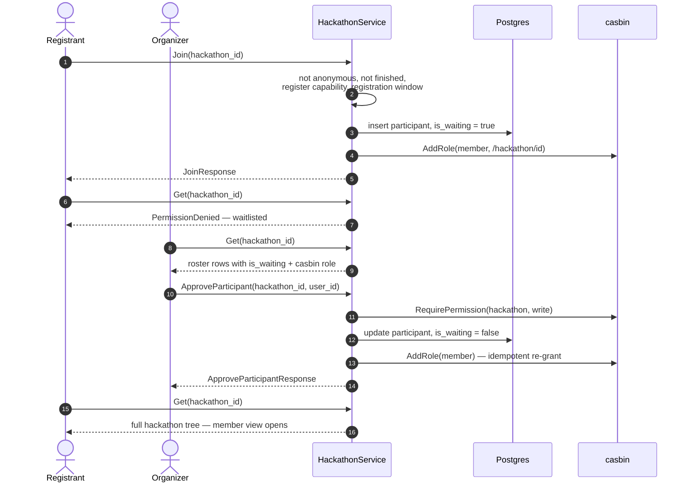
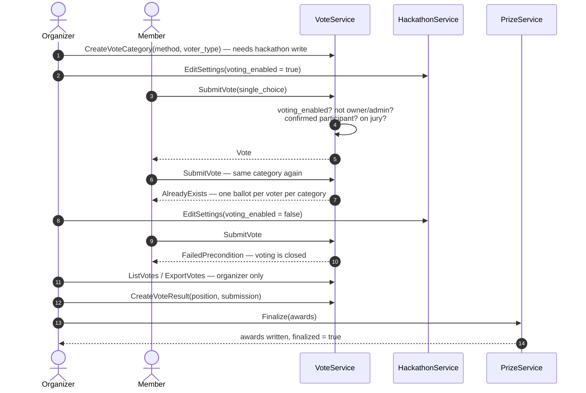

# The hackathon lifecycle

What actually happens between "we're running a hackathon" and "here are the
winners", as the platform behaves on branch `sketch/06-08-26`. Written for
organizers running an event and for developers adding to the flow.

## Where the spec lives

The executable specification is `.claude/skills/hackathon-e2e/recipe.jsonl` —
one JSON action per line, 309 actions across nine acts (0-8), played strictly in
order by `.claude/skills/hackathon-e2e/tests/journey/recipe.spec.ts`. It runs
the whole story on an empty database with a 15-person cast. Its companion guide
is `.claude/skills/hackathon-e2e/SKILL.md`.

Every action carries triage metadata: `priority` (P1 215 / P2 85 / P3 9),
`outcome` (human-readable expectation), an optional `todo` (placeholder note, 24
actions) and an optional `gate` (24 actions — skip until the listed RPCs exist,
capability-probed at runtime by `scripts/probe.sh`, so an action wakes up by
itself the day its backend lands). `implement: false` used to mark work
deliberately deferred; **no action sets it any more** — nothing in the recipe is
deferred.

Treat the recipe as the product spec: **policy questions are settled by making a
recipe action pass**, and the decisions below are pinned that way. Action ids
are cited here only where the behaviour would otherwise be ambiguous.

Run it:

```bash
bash .claude/skills/devcontainer-up/scripts/up.sh
bash .claude/skills/devcontainer-up/scripts/e2e.sh journey
bash .claude/skills/hackathon-e2e/scripts/run.sh journey --until-act 4  # freeze mid-story
```

**Time travel works by moving the event, not the clock.** `HackathonStatus` is
computed server-side from `starts_at` / `ends_at`, so the story shifts the
event's dates via `HackathonService.Edit` rather than faking time (which would
fight Keycloak and JWT expiry). `scripts/timeshift.sh <uuid> <days>` does it by
hand. Time-window fields must be moved together with the event dates.

## Timeline

| Act | Story time         | Headline                                                                              | Main actors              |
| --- | ------------------ | ------------------------------------------------------------------------------------- | ------------------------ |
| 1   | T-4 months         | Publication: create, configure, announce; pages and tracks; a private draft alongside | admin / organizer        |
| 2   | T-3 months         | Registration opens; 13 sign-ups arrive, all waitlisted; registration forms filled     | everyone                 |
| 3   | T-2 months         | Project proposals; organizer approves some, one is withdrawn                          | participants + organizer |
| 4   | T-1.5 to T-1 month | Preferences, team formation, rebalancing; webinar page                                | organizer                |
| 5   | T-1 week           | Roster cut: 8 approved; a dropout, a backfill; registration closes                    | organizer                |
| 6   | T0 / T+1           | Event days: no-show, walk-in, phases, submissions, deadline override                  | everyone                 |
| 7   | T+1 evening        | Voting and awards; admin finalizes prizes                                             | members + admin          |
| 8   | T+1 week           | Post-event: archive, winners page, wrap-up blog, cleanup                              | admin                    |

## Act 1 — T-4 months: publication

The organizer creates the hackathon (`HackathonService.Create`). Three things
happen atomically-ish inside that one call:

1. the hackathon row, with `visibility`, dates, description and a logo (a data
   URI — there is no blob store);
2. **one capability row per capability**, all enabled — see
   [gates](#the-three-gates) — so the hackathon states its policy explicitly
   rather than being ambiguously ungoverned;
3. a settings row (both flags `false`), a casbin `owner` grant for the creator,
   and a participant row for the creator so they appear on their own roster.

Then the organizer configures the event through `ConfigService`:

| Call                  | What it sets                                                                                                            |
| --------------------- | ----------------------------------------------------------------------------------------------------------------------- |
| `SetRegistrationForm` | registration fields + consents (the schema registrants must conform to)                                                 |
| `SetSubmissionForm`   | submission fields (repo / demo / slides / summary)                                                                      |
| `SetVotingPolicy`     | mechanism, scale, `oneBallotPer`, `ownTeamVoting`, `organizerVoting`, tie-breaks                                        |
| `SetWindows`          | `registration_opens`, `registration_closes`, `proposals_close`, `preferences_close`, `submissions_close`, `late_policy` |
| `PrizeService.Set`    | the prize table (ranks + titles), defined up front                                                                      |

Pages (`PageService.Create`) and tracks (`TrackService.Create`) are published
here too. A second, **private** hackathon is drafted in parallel and stays
invisible to anonymous visitors and to the anonymous `List` API.

Edit cycles are normal and supported: a name typo is published, noticed and
fixed; the event is rescheduled; the venue changes — all through
`HackathonService.Edit`, which returns the updated entity.

Who can do what: **only `hackathon:write` holders** (the owner and global
admins) may create, edit, configure or price the event. A regular signed-in user
attempting `Create` or `Edit` gets `PermissionDenied`. Anonymous visitors see
the public listing and the public pages, nothing else.

Two UX gaps are pinned here rather than hidden (both marked `TODO(ux)` in the
recipe): a signed-in **non-member** clicking a public event is redirected into
the member view and lands on a 403 (`act1.flow.bob`), and the dashboard's Join
button is still a stub.

## Act 2 — T-3 months: registration

The organizer moves `registration_opens` into the past and the wave arrives.
Thirteen people call `HackathonService.Join`.

What `Join` does, in order:

1. reject anonymous callers → `Unauthenticated`;
2. reject a hackathon whose `ends_at` is in the past → `FailedPrecondition`;
3. require the `register` capability to be open (organizers bypass this);
4. require the registration window to be open (**organizers do not bypass**);
5. insert a participant row with `is_waiting = true`;
6. grant the casbin `member` role.

Everyone lands on the **waitlist**. The `member` role is granted immediately —
`is_waiting` is what carries the approved/waitlisted distinction, not casbin. A
second `Join` is idempotent and returns success — though note that the gates at
steps 2–4 run _before_ the already-a-participant check, so re-joining after the
window has closed fails rather than no-opping.

Registrants fill the organizer's form
(`HackathonService.SubmitRegistrationForm`). Validation is strict and pinned by
two negatives: an unknown field, and a missing required consent, both
`InvalidArgument`. Optional consents must be honoured — one registrant declines
photo consent in act 2 and that has to still be true when photos are published
in act 8. Forms are independent of approval: a waitlisted registrant may submit
one.

Meanwhile the organizer watches the roster grow, briefly unlists the event
(`visibility` → private, which immediately removes it from the public home and
from the anonymous `List` API) and relists it. Non-admins calling
`UserService.List` get `PermissionDenied`.

What a waitlisted registrant sees: their dashboard shows the event with a
**Waitlisted** badge; opening the member view returns **403**.

## Act 3 — T-2 months: proposals

Participants call `ProjectService.Propose`, which requires `project:propose`,
the `propose_projects` capability, and an open proposals window. The proposer
becomes `owner` of that project's domain, which is what later lets them edit or
withdraw their own proposal while leaving everyone else's alone.

The organizer approves proposals (`Approve` / `Disapprove`, `project:write`). A
proposer withdraws their own (`Delete`, which also revokes the project-owner
role).

Pinned here: **waitlisted registrants may propose** (`act3.propose.waitlisted`)
— they hold `member` from `Join`, and `member` has `project:propose` on every
hackathon. Anonymous callers get `Unauthenticated`; a non-registrant approving a
proposal gets `PermissionDenied`; approving a ghost id gets `NotFound`.

## Act 4 — T-1.5 to T-1 month: teams

Participants express preferences (`ProjectService.SetPreference`) and may
re-rank them. `SetPreference` has **no casbin check at all**: it requires a
participant row in the hackathon — waiting or not — plus the
`set_team_preferences` capability and an open preferences window. Preferences
are expressed before the roster cut on purpose, so team formation can consider
the whole list.

The organizer exports the preferences (`ExportPreferences`, `project:write`),
then builds teams:

- `TeamService.Create` (`team:create` — organizer only);
- `AssignUser` / `RemoveUser` (`team:write` at the **hackathon** domain —
  organizer only; members hold `team:write` only at their own team's domain);
- assignment also grants the assignee `member` at `/hackathon/<id>/team/<id>`,
  which is what unlocks submissions for that team.

Rebalancing is a first-class flow (assign → remove → reassign), and a
placeholder team is created and deleted again. **Everyone confirmed gets a
seat**, and team composition cascades with the roster (see act 5).

At T-1 month the preferences deadline passes: the organizer moves
`preferences_close` into the past, and a late `SetPreference` bounces with
`FailedPrecondition`.

## Act 5 — T-1 week: the roster cut

The organizer approves 8 of the 13 registrants
(`HackathonService.ApproveParticipant`, `hackathon:write`), which flips
`is_waiting` to false and re-grants `member`. Double-approving is harmless.

**Capacity is organizer-enforced, not backend-enforced.** There is no capacity
field anywhere in the backend and no cap on approvals — the announced "max
capacity: 8" lives in the description text, and the organizer simply stops
approving. Getting this wrong is a process error, not a rejected RPC.

The moment approval lands, the world changes for that person: badge flips from
Waitlisted to **Member**, and the member view returns **200**. Waitlisted
registrants stay at 403.

Churn is modelled explicitly:

| Event             | Mechanism                                       | Effect                                                                                                         |
| ----------------- | ----------------------------------------------- | -------------------------------------------------------------------------------------------------------------- |
| **Dropout**       | `RemoveParticipant`                             | participant row deleted, `member` role revoked; the person immediately loses `Get` access (`PermissionDenied`) |
| Team-seat cleanup | `TeamService.RemoveUser`                        | their team seat is cleared separately — removing a participant does **not** cascade to teams                   |
| **Backfill**      | `ApproveParticipant` on a waitlisted registrant | they gain member access, then `AssignUser` puts them in the freed seat                                         |

Then registration closes (`registration_closes` moved into the past). A late
`Join` bounces with `FailedPrecondition` — **including one attempted by the
admin**, because the window gate has no organizer bypass; reopening requires an
explicit `ConfigService.OverrideWindow`.

Members can now tour the event: overview, participants, timeline, teams,
webinars. Global admins reach the member view of any hackathon through the
escape hatch even without a participant row.

Roster after the cut, as the recipe asserts it (counts **include the organizer's
own participant row**): 13 on the list, 9 approved, 4 waitlisted.

### From Join to member view

The whole arc — the registrant's first `Join` in act 2, the organizer reading
the roster, and the approval in act 5 that opens the member view:



The organizer's roster view is just `HackathonService.Get`: it eager-loads the
participant rows and resolves each one's casbin role, which is what the
`HackathonMember` entity unifies.

**Walk-in variant (act 6).** Same shape, one step in front: the registration
window has closed, so the organizer first calls
`ConfigService.OverrideWindow{window: "registration", extendMinutes: N}` —
anchored at _now_ — and only then does `Join` succeed; `ApproveParticipant`
follows immediately instead of a month later.

## Act 6 — T0 / T+1: event days

The organizer shifts the dates onto today; `HackathonStatus` computes to
**Active** and the public home says so.

Two real-world flows are pinned:

**No-show.** A confirmed participant never turns up. The organizer clears their
team seat (`TeamService.RemoveUser`) but leaves the participant row alone — a
no-show is _off the team, not out of the event_, and still passes
`HackathonService.Get`.

**Walk-in.** Someone hears about the event that morning:

1. `UserService.Register` — creates the platform account from Keycloak claims;
2. `ConfigService.OverrideWindow{window: "registration", extendMinutes: 120}` —
   the organizer reopens registration. The override is anchored at **now**, not
   at the configured close, so "extend by N minutes" always means N minutes from
   the moment the organizer says it;
3. `Join` — waitlisted for a moment;
4. `ApproveParticipant` — confirmed on the spot;
5. `SubmitRegistrationForm{on_behalf_of: <walk-in>}` — the organizer digitizes
   the paper form from the check-in desk (this is the only `on_behalf_of` path
   that exists; it requires `hackathon:write`);
6. `AssignUser` — into the no-show's seat.

Phases (`PhaseService.Create`) go on the schedule and render in order on the
member timeline; a participant attempting to edit the schedule gets
`PermissionDenied`. `HackathonService.AdvancePhase` is the organizer's one
control for "we are now in phase X": it declares the current phase and flips
every scheduled capability to match, leaving unscheduled ones (voting,
registration) alone.

Submissions:

| Call                                | Gate                                                                                                                                         |
| ----------------------------------- | -------------------------------------------------------------------------------------------------------------------------------------------- |
| `CreateSubmission`                  | `submission:create` at the team domain, submissions window, `create_project_submissions` capability                                          |
| `EditSubmission`                    | `submission:write` at the team domain, window; refuses if the submission is already `final` (finalized submissions are frozen)               |
| `FinalizeSubmission`                | `submission:write` at the team domain, capability — gated as well as create, so a draft made before the close cannot be turned in afterwards |
| `GetSubmission` / `ListSubmissions` | `submission:read` at the team domain **or** at the hackathon level                                                                           |

**Members read every team's submissions, hackathon-wide.** That is a deliberate
`p` rule (`member, /hackathon/*, submission, read`): demo day and voting both
require seeing what the other teams turned in. Submitting _for_ another team is
still `PermissionDenied`.

Deadline theatre, exactly as it happens in practice: the submissions window
closes, a late submission bounces with `FailedPrecondition`, the organizer
extends by 30 minutes for AV problems (`OverrideWindow`), and the grace-period
submission is accepted.

## Act 7 — T+1 evening: voting and awards

The organizer defines vote categories (`VoteService.CreateVoteCategory`,
`hackathon:write`), each with a voting method and a voter type
(`ALL_PARTICIPANTS` or `JURY`).

**Voting is opened and closed by a settings toggle, not by an RPC of its own:**
`HackathonService.EditSettings{voting_enabled: true|false}`. There is no
`Open`/`Close` on `VoteService`.

`SubmitVote` accepts a ballot only when all of these hold:

- the caller is authenticated (anonymous → `Unauthenticated`);
- `voting_enabled` is true (otherwise `FailedPrecondition`, "voting is closed");
- for a **jury** category, the caller is on the jury list;
- for an **all-participants** category, the caller is **not** the hackathon
  owner and **not** a global admin — _organizers are neutral: whoever runs the
  event does not vote in it_ — and is a **confirmed** participant
  (`is_waiting = false`), so waitlisted registrants are refused;
- only `single_choice` ballots are accepted for now — ranked and points ballots
  need a schema change and return `InvalidArgument` (deliberately not
  `Unimplemented`, which the capability probe would read as "the RPC does not
  exist").

A unique index on `(category, voter)` makes it **one ballot per voter per
category**; a second attempt is `AlreadyExists`. After the organizer flips
`voting_enabled` back to false, late ballots bounce.

Then the results and the prizes:

- `CreateVoteResult` records placements — organizer/admin only;
- `ListVoteResults` is readable by any signed-in user; raw ballots (`ListVotes`,
  `ExportVotes`) and `ExportResults` are organizer/admin only;
- `PrizeService.Finalize` writes the awards and sets `finalized = true`.

**Votes are advisory; the admin has the final voice.** The tally does not assign
prizes — a human reviews it and finalizes. Prizes stay editable afterwards
(`PrizeService.Edit`, e.g. adding a sponsor credit), and a member attempting to
touch the prize table gets `PermissionDenied`.

### From categories to awards



Nothing between `SubmitVote` and `Finalize` is automatic: `CreateVoteResult`
records the placements a human decided on, and `PrizeService.Finalize` writes
the awards. Until that call, the ballots are data, not an outcome.

## Act 8 — T+1 week: post-event

The event moves into the past and the status flips to **Finished**. A late
`Join` is refused with `FailedPrecondition` ("hackathon is already finished") —
this check runs before the capability and window gates, so not even the
organizer can register someone after the fact.

Access is retained, not revoked: confirmed members keep the member view (200),
waitlisted registrants keep their 403, and the whole event history stays
readable.

The organizer publishes the ending: a thank-you and the winners in the
description, a **Photos & Winners** page, and a **wrap-up blog post**. Both are
`PageService` pages of a public hackathon, which means **anonymous visitors can
read them** — the public route
`components/frontend/src/routes/(public)/hackathon/[id]/+page.server.ts` fetches
them with an unauthenticated client. Obsolete pages (the webinar page) and the
never-announced private draft are deleted.

Two never-approved registrants delete their platform profiles. That flow is
documented but **not implemented** (`UserService.DeleteAccount` has no proto);
its verification step is gated behind it.

## The three gates

Three independent mechanisms decide whether a call succeeds. They compose — all
must pass — and they fail with different codes, which is how you tell them apart
in a log.

| Gate                                   | Question                            | Code on failure                                         | Organizer bypass                                          |
| -------------------------------------- | ----------------------------------- | ------------------------------------------------------- | --------------------------------------------------------- |
| **casbin** (`RequirePermission`)       | may this user ever do this?         | `PermissionDenied` (or `Unauthenticated` for anonymous) | n/a — the admin escape hatch _is_ the bypass              |
| **capabilities** (`requireCapability`) | is this action switched on?         | `FailedPrecondition`                                    | **yes** — anyone with `hackathon:write` skips it entirely |
| **time windows** (`requireWindowOpen`) | are we inside the announced window? | `FailedPrecondition`                                    | **no** — requires an explicit `OverrideWindow`            |

Authorization is documented in `docs/backend/rbac.md`.

**Capabilities** (`components/backend/internal/capability`, enforced via
`internal/service/capability.go`): `register`, `propose_projects`,
`set_team_preferences`, `create_project_submissions`, `vote`, `view_results`.
Each hackathon gets one row per capability at creation, **all enabled by
default** — so introducing capabilities was behaviour-preserving and a new
hackathon is not bricked before an organizer settings screen exists. Closing an
action is an explicit act (`EditCapability`), or a consequence of `AdvancePhase`
when the capability is linked to phases. Rows may be linked to an opening and a
closing phase, which is what lets a member see "opens in 19 days" instead of a
bare "closed".

**Windows** (`HackathonWindows`, set by `ConfigService.SetWindows`): a missing
row or an unset field means no enforcement at all. `OverrideWindow` exists only
for `registration` and `submissions` — proposals and preferences have no
override path. `late_policy` is stored and echoed back but nothing reads it.

**Settings** (`HackathonSettings`): `voting_enabled` is enforced (by
`SubmitVote`). `registrations_enabled` is **not enforced anywhere** on this
branch — see the note below.

## Pinned policy decisions

| Decision                                                                                                                | Where it is enforced                                                                      |
| ----------------------------------------------------------------------------------------------------------------------- | ----------------------------------------------------------------------------------------- |
| `Join` grants the casbin `member` role immediately; `is_waiting` carries approved-vs-waitlisted                         | `HackathonService.Join`                                                                   |
| The member view needs a **confirmed** participant row (or owner, or global admin) — a `member` role alone is not enough | `viewerMayOpenMemberView` in `HackathonService.Get`; asserted as 403 vs 200 in the recipe |
| Waitlisted registrants may propose projects and set preferences                                                         | `project:propose` for `member`; `SetPreference`'s participant-row check                   |
| Waitlisted registrants may submit the registration form                                                                 | `SubmitRegistrationForm` has no waitlist check                                            |
| Anonymous mutations are rejected with `Unauthenticated`, never `PermissionDenied`                                       | `RequirePermission` + hand-written `AnonSubject` checks                                   |
| Organizers and global admins **cannot vote** in all-participant categories                                              | `VoteService.SubmitVote`                                                                  |
| Waitlisted registrants cannot vote                                                                                      | `SubmitVote`'s confirmed-participant check                                                |
| One ballot per voter per category                                                                                       | unique index on `(category, voter)`                                                       |
| Members read every team's submissions hackathon-wide                                                                    | `member, /hackathon/*, submission, read`                                                  |
| Pages of a public hackathon are anonymous-readable; hidden pages are not                                                | `PageService.List` public fallback                                                        |
| Voting opens and closes via `EditSettings{voting_enabled}` — no dedicated RPC                                           | `VoteService.SubmitVote`                                                                  |
| Window overrides are anchored at **now**, not at the configured close                                                   | `ConfigService.OverrideWindow`                                                            |
| Registration windows bind organizers too; capabilities do not                                                           | `requireWindowOpen` vs `requireCapability`                                                |
| Capacity is enforced by the organizer approving or not approving — there is no backend cap                              | absence of any capacity field                                                             |
| A no-show loses their team seat but stays a confirmed participant                                                       | act-6 flow; `RemoveUser` ≠ `RemoveParticipant`                                            |
| Removing a participant does not cascade to their team seat — clear it separately                                        | `RemoveParticipant`                                                                       |
| Finalized submissions are frozen                                                                                        | `EditSubmission`                                                                          |
| Votes are advisory; prizes are finalized by the admin and stay editable afterwards                                      | `PrizeService.Finalize` / `Edit`                                                          |
| `Join`, `ApproveParticipant` are idempotent; ghost ids are `NotFound`, malformed ids `InvalidArgument`                  | the handlers                                                                              |
| Media are **links**, not uploads — no avatar field and no blob store exists                                             | recipe design decision                                                                    |

### Divergence worth knowing about

`registrations_enabled` (in `HackathonSettings`, editable through
`EditSettings`) is **stored but never read** by any enforcement path.
`HackathonService.Join` is gated by the `register` **capability** instead. The
handler says so explicitly:

> MERGE NOTE (sketch): #87 (Register capability) and #78
> (settings.registrations_enabled) both gate Join, with contradictory defaults —
> their test suites cannot both pass with both gates active. The capability
> governs here; settings remain editable data until the team consolidates on one
> mechanism.

Note the defaults point opposite ways: `registrations_enabled` defaults to
`false`, every capability defaults to enabled. Consolidating on one mechanism is
an open decision.

## Open decisions

Carried from `todo` notes in the recipe and from gaps found in the code. None of
these is settled on this branch.

| #   | Question                                                                                                                                                                                                                                                         | Current behaviour                                                                                                                                                            | Pointer                   |
| --- | ---------------------------------------------------------------------------------------------------------------------------------------------------------------------------------------------------------------------------------------------------------------- | ---------------------------------------------------------------------------------------------------------------------------------------------------------------------------- | ------------------------- |
| 1   | **Own-team voting.** May a team member vote for their own team's submission?                                                                                                                                                                                     | `SetVotingPolicy` stores `ownTeamVoting` but **nothing enforces it**; the recipe casts own-team ballots and marks them "decide policy" (`act7.cast.alice`, `act7.cast.bob2`) | `SubmitVote`              |
| 2   | **Registration gating: capability or setting?**                                                                                                                                                                                                                  | Both exist with contradictory defaults; only the capability is enforced                                                                                                      | `Join`'s MERGE NOTE       |
| 3   | **Organizer registration on behalf of someone.** `on_behalf_of` exists for the registration _form_ only — the walk-in still has to create an account and call `Join` themselves                                                                                  | no `on_behalf_of` on `Join` / `ApproveParticipant`                                                                                                                           | `SubmitRegistrationForm`  |
| 4   | **Private-hackathon invitations.** There is no invitation mechanism. `Join` performs **no visibility check** — anyone authenticated who knows the UUID can join a private hackathon; privacy today is discovery-only (`List` filters, `Get` requires membership) | —                                                                                                                                                                            | `HackathonService.Join`   |
| 5   | **Ranked and points ballots.** The voting policy can specify them, but `SubmitVote` accepts `single_choice` only; the `Vote` row shape (one row per category+voter) cannot hold a ranking                                                                        | `InvalidArgument`                                                                                                                                                            | `SubmitVote`              |
| 6   | **Structured submissions.** Submissions are a single `result` blob, so the submission form's fields cannot be validated; file uploads wait on a blob store                                                                                                       | deferred (`act6.submit.invalid`, `implement: false`)                                                                                                                         | —                         |
| 7   | **Account deletion semantics.** `UserService.DeleteAccount` has no proto. Decide: are participant rows removed? are casbin `g`/`g2` rows purged? is the Keycloak account left untouched?                                                                         | not implemented                                                                                                                                                              | `act8.account.liam`       |
| 8   | **Hackathon delete cascade.** `Delete` removes configuration and roster rows but refuses (`FailedPrecondition`) when projects, pages or teams remain — "archive it instead". Richer cascades belong to an archival flow that does not exist                      | partial                                                                                                                                                                      | `HackathonService.Delete` |
| 9   | **Email / notification.** No notification service exists; `SetEmailTemplates` is documentation only                                                                                                                                                              | not implemented                                                                                                                                                              | `act1.config.emails`      |
| 10  | **Branding beyond the logo.** Only the logo field exists; colors and visuals have no home                                                                                                                                                                        | not implemented                                                                                                                                                              | `act1.config.branding`    |
| 11  | **Role-granting RPCs.** `user.UserService/AddRole` and `RemoveRole` exist in the proto but have no handler; global roles come only from config bootstrap and the seeder                                                                                          | `Unimplemented`                                                                                                                                                              | `docs/backend/rbac.md`    |
| 12  | **Public detail page for signed-in non-members.** They are redirected into the member view and get a 403 instead of seeing the public marketing page                                                                                                             | pinned as today's behaviour                                                                                                                                                  | `act1.flow.bob`           |
| 13  | **Untranslated 500s.** `/manage/users` does not catch `PermissionDenied`, so non-admins get a 500 instead of a 403                                                                                                                                               | pinned as today's behaviour                                                                                                                                                  | `act2.flow.alice.users`   |
| 14  | **`late_policy`.** Stored on the windows row, echoed back, and read by nothing                                                                                                                                                                                   | inert                                                                                                                                                                        | `requireWindowOpen`       |

## See also

- [requirements.md](requirements.md) — the same acts as a requirement list.
- [TODO.md](TODO.md) — the open decisions above, as work items.
- [backend/rbac.md](backend/rbac.md) — the first of the three gates, in full,
  with the participant state machine.
- [roadmap.md](roadmap.md) — which parts of this lifecycle are MVP.
- [glossary.md](glossary.md) — capability, window, waitlist, member view.
